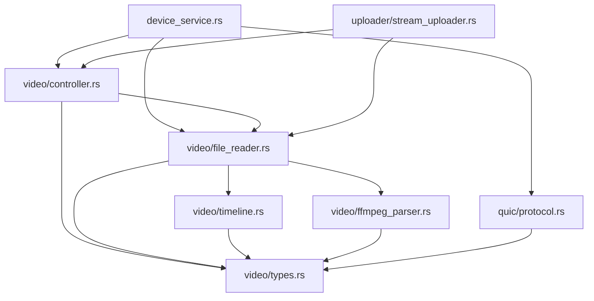
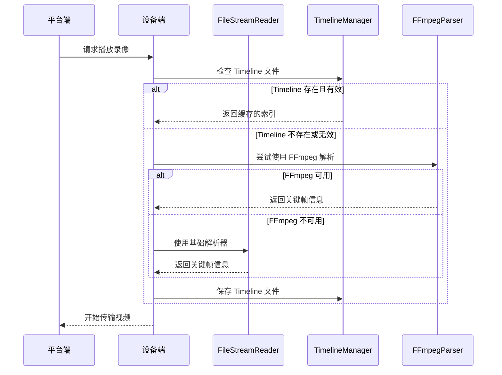
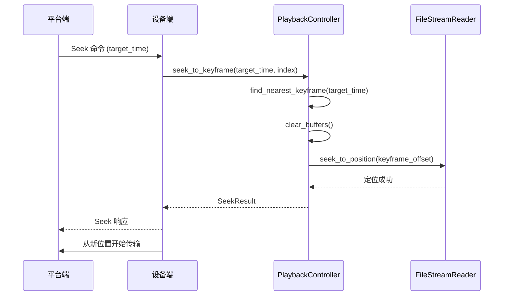

# Device-Uploader 功能合并设计文档

## 文档信息

| 项目 | 内容 |
|------|------|
| 功能名称 | Device-Uploader 高级功能合并到 Device-Simulator |
| 创建日期 | 2025-12-14 |
| 状态 | 设计阶段 |
| 优先级 | 高 |

## 概述

本设计文档描述了将 device-uploader 项目中的高级功能合并到 device-simulator 项目的技术方案。合并的核心目标是：

1. 为 device-simulator 添加精确的关键帧定位能力
2. 实现 Timeline 文件缓存系统以提高性能
3. 集成 FFmpeg CLI 工具进行可靠的视频解析
4. 实现高级播放控制器支持倍速播放和帧丢弃策略
5. 保持向后兼容性，不破坏现有功能

### 设计原则

- **模块化**: 新功能以独立模块形式添加，最小化对现有代码的影响
- **可选性**: 高级功能为可选特性，基础功能不依赖它们
- **性能优先**: 使用内存优化策略，避免性能退化
- **向后兼容**: 保持现有 QUIC 协议和 API 接口不变

## 架构设计

### 整体架构

```
device-simulator/
├── src/
│   ├── main.rs                    # 主入口
│   ├── config.rs                  # 配置管理
│   ├── device_service.rs          # 设备服务（扩展）
│   ├── quic/                      # QUIC 通信模块
│   │   ├── mod.rs
│   │   ├── connection.rs
│   │   └── protocol.rs            # 协议扩展（新增 Seek 命令）
│   ├── video/                     # 视频处理模块
│   │   ├── mod.rs
│   │   ├── file_reader.rs         # 【新增】文件读取和关键帧索引
│   │   ├── timeline.rs            # 【新增】Timeline 文件管理
│   │   ├── ffmpeg_parser.rs       # 【新增】FFmpeg CLI 集成
│   │   ├── controller.rs          # 【新增】播放控制器
│   │   ├── types.rs               # 【新增】类型定义
│   │   └── scanner.rs             # 现有视频扫描器
│   └── uploader/                  # 上传模块
│       ├── mod.rs
│       └── stream_uploader.rs     # 现有流上传器（扩展）
```

### 模块依赖关系



## 组件和接口

### 1. 关键帧索引系统 (video/file_reader.rs)

#### 核心数据结构

```rust
/// 关键帧索引
pub struct KeyframeIndex {
    pub entries: Vec<KeyframeEntry>,
    pub total_duration: f64,
    pub index_precision: f64,
    pub memory_optimized: bool,
    pub optimization_strategy: IndexOptimizationStrategy,
    pub memory_usage: usize,
}

/// 关键帧条目
pub struct KeyframeEntry {
    pub timestamp: f64,        // 时间戳（秒）
    pub file_offset: u64,      // 文件偏移位置
    pub frame_size: u32,       // 关键帧大小
    pub gop_size: u32,         // GOP大小
    pub frame_type: FrameType, // 帧类型
}

/// 索引优化策略
pub enum IndexOptimizationStrategy {
    Full,           // 完整索引，所有关键帧
    Sparse,         // 稀疏索引，定期采样
    Adaptive,       // 自适应，根据内存动态调整
    Hierarchical,   // 分层索引，多级精度
}

/// Seek 操作结果
pub struct SeekResult {
    pub requested_time: f64,
    pub actual_time: f64,
    pub keyframe_offset: u64,
    pub precision_achieved: f64,
    pub keyframe_used: KeyframeEntry,
    pub execution_time: Duration,
}
```

#### 接口定义

```rust
#[async_trait]
pub trait FileStreamReader {
    /// 打开视频文件
    async fn open_file(&self, file_path: &Path) -> Result<File, FileError>;
    
    /// 读取数据块
    async fn read_chunk(&self, handle: &mut File, size: usize) -> Result<Vec<u8>, FileError>;
    
    /// 获取文件信息
    async fn get_file_info(&self, handle: &mut File) -> Result<VideoFileInfo, FileError>;
    
    /// 定位到文件位置
    async fn seek_to_position(&self, handle: &mut File, position: u64) -> Result<(), FileError>;
    
    /// 定位到时间点（使用关键帧索引）
    async fn seek_to_time(
        &self, 
        handle: &mut File, 
        time_seconds: f64, 
        index: &KeyframeIndex
    ) -> Result<u64, FileError>;
    
    /// 构建关键帧索引
    async fn build_keyframe_index(&self, handle: &mut File) -> Result<KeyframeIndex, FileError>;
    
    /// 使用特定策略构建关键帧索引
    async fn build_keyframe_index_with_strategy(
        &self, 
        handle: &mut File, 
        strategy: IndexOptimizationStrategy
    ) -> Result<KeyframeIndex, FileError>;
    
    /// 使用内存限制构建关键帧索引
    async fn build_keyframe_index_with_memory_limit(
        &self, 
        handle: &mut File, 
        memory_limit_mb: usize
    ) -> Result<KeyframeIndex, FileError>;
}
```

#### 实现要点

1. **H.264 NAL 单元解析**: 识别 I 帧（关键帧）
2. **内存优化**: 根据策略选择性存储关键帧信息
3. **精确定位**: 使用二分查找快速定位最近的关键帧
4. **性能监控**: 记录索引构建时间和内存使用

### 2. Timeline 文件缓存系统 (video/timeline.rs)

#### 数据结构

```rust
/// Timeline 文件格式
#[derive(Serialize, Deserialize)]
pub struct TimelineFile {
    pub version: u32,
    pub video_file_path: PathBuf,
    pub video_file_hash: String,      // 文件哈希，用于检测变化
    pub video_file_size: u64,
    pub video_file_modified: SystemTime,
    pub duration: f64,
    pub resolution: Resolution,
    pub frame_rate: f64,
    pub keyframe_index: KeyframeIndex,
    pub created_at: SystemTime,
    pub ffmpeg_version: Option<String>,
}
```

#### 接口定义

```rust
pub trait TimelineManager {
    /// 加载 Timeline 文件
    async fn load_timeline(&self, video_path: &Path) -> Result<Option<TimelineFile>, TimelineError>;
    
    /// 保存 Timeline 文件
    async fn save_timeline(&self, timeline: &TimelineFile) -> Result<(), TimelineError>;
    
    /// 验证 Timeline 文件是否有效
    async fn validate_timeline(&self, timeline: &TimelineFile, video_path: &Path) -> Result<bool, TimelineError>;
    
    /// 删除 Timeline 文件
    async fn delete_timeline(&self, video_path: &Path) -> Result<(), TimelineError>;
    
    /// 获取 Timeline 文件路径
    fn get_timeline_path(&self, video_path: &Path) -> PathBuf;
}
```

#### 实现要点

1. **文件命名**: `{video_filename}.timeline`
2. **格式**: JSON 格式，便于调试和版本控制
3. **验证**: 比较文件大小、修改时间和哈希值
4. **版本控制**: 支持向后兼容的版本升级

### 3. FFmpeg CLI 集成 (video/ffmpeg_parser.rs)

#### 数据结构

```rust
/// FFmpeg 解析结果
pub struct FFmpegVideoInfo {
    pub duration: f64,
    pub resolution: Resolution,
    pub codec: String,
    pub frame_rate: f64,
    pub bit_rate: u64,
    pub has_audio: bool,
    pub keyframe_timestamps: Vec<f64>,
}

/// FFmpeg 配置
pub struct FFmpegConfig {
    pub ffmpeg_path: PathBuf,
    pub ffprobe_path: PathBuf,
    pub timeout: Duration,
    pub min_version: String,
}
```

#### 接口定义

```rust
pub trait FFmpegParser {
    /// 检查 FFmpeg 是否可用
    async fn check_availability(&self) -> Result<bool, FFmpegError>;
    
    /// 获取 FFmpeg 版本
    async fn get_version(&self) -> Result<String, FFmpegError>;
    
    /// 提取视频元数据
    async fn extract_metadata(&self, video_path: &Path) -> Result<FFmpegVideoInfo, FFmpegError>;
    
    /// 提取关键帧信息
    async fn extract_keyframes(&self, video_path: &Path) -> Result<Vec<f64>, FFmpegError>;
    
    /// 验证视频文件
    async fn validate_video(&self, video_path: &Path) -> Result<bool, FFmpegError>;
}
```

#### 实现要点

1. **命令行调用**: 使用 `tokio::process::Command`
2. **超时控制**: 防止长时间阻塞
3. **错误处理**: 解析 FFmpeg 输出，提取错误信息
4. **回退机制**: FFmpeg 不可用时使用基础解析器

### 4. 播放控制器 (video/controller.rs)

#### 数据结构

```rust
/// 播放控制器
pub struct PlaybackController {
    current_position: f64,
    playback_rate: f64,
    transmission_queue: VecDeque<VideoSegment>,
    buffer_manager: BufferManager,
    sync_offset: f64,
    last_seek_position: Option<f64>,
    frame_drop_strategy: DropFrameStrategy,
}

/// 帧丢弃策略
pub enum DropFrameStrategy {
    DropNone,              // 不丢帧
    DropNonKeyframes,      // 仅保留关键帧
    DropByRate(f32),       // 按比例丢帧
    Adaptive,              // 自适应丢帧
}

/// 缓冲区管理器
pub struct BufferManager {
    video_buffers: HashMap<u64, Vec<u8>>,
    max_buffer_size: usize,
    current_buffer_size: usize,
    buffer_health: BufferHealth,
}
```

#### 接口定义

```rust
#[async_trait]
pub trait PlaybackControllerTrait {
    /// 定位到指定位置
    async fn seek(&mut self, position: f64) -> Result<(), PlaybackError>;
    
    /// 定位到关键帧
    async fn seek_to_keyframe(
        &mut self, 
        position: f64, 
        index: &KeyframeIndex
    ) -> Result<SeekResult, PlaybackError>;
    
    /// 设置播放速率
    async fn set_playback_rate(&mut self, rate: f64) -> Result<(), PlaybackError>;
    
    /// 获取帧丢弃策略
    fn get_drop_frame_strategy(&self, rate: f64) -> DropFrameStrategy;
    
    /// 调整传输队列
    fn adjust_transmission_queue(
        &self,
        segments: Vec<VideoSegment>,
        playback_rate: f64,
    ) -> Vec<VideoSegment>;
    
    /// 清除缓冲区
    fn clear_buffers(&mut self) -> Result<(), PlaybackError>;
    
    /// 查找最近的关键帧
    fn find_nearest_keyframe(&self, timestamp: f64, index: &KeyframeIndex) -> Option<KeyframeEntry>;
}
```

#### 实现要点

1. **倍速播放**: 支持 0.25x 到 4x 的播放速率
2. **帧丢弃**: 根据播放速率自动选择丢帧策略
3. **缓冲管理**: 动态调整缓冲区大小
4. **音视频同步**: 维护同步偏移量

### 5. QUIC 协议扩展 (quic/protocol.rs)

#### 新增命令

```rust
/// 播放控制命令
pub enum PlaybackCommand {
    Seek { target_time: f64 },
    SetPlaybackSpeed { speed: f32 },
    GetKeyframeIndex,
    Pause,
    Resume,
    Stop,
}

/// 命令码定义
pub const CMD_SEEK: u8 = 0x10;
pub const CMD_SET_PLAYBACK_SPEED: u8 = 0x11;
pub const CMD_GET_KEYFRAME_INDEX: u8 = 0x12;
```

#### 协议格式

```
Seek 命令:
+--------+----------------+
| 0x10   | target_time    |
| 1 byte | 8 bytes (f64)  |
+--------+----------------+

SetPlaybackSpeed 命令:
+--------+----------------+
| 0x11   | speed          |
| 1 byte | 4 bytes (f32)  |
+--------+----------------+

Seek 响应:
+--------+----------------+----------------+----------------+
| 0x10   | requested_time | actual_time    | precision      |
| 1 byte | 8 bytes (f64)  | 8 bytes (f64)  | 8 bytes (f64)  |
+--------+----------------+----------------+----------------+
```

## 数据模型

### 关键帧索引数据流



### Seek 操作数据流



## 数据模型详细设计

### 关键帧索引存储

```rust
// 内存中的索引结构
pub struct KeyframeIndex {
    entries: Vec<KeyframeEntry>,      // 关键帧列表
    total_duration: f64,               // 总时长
    index_precision: f64,              // 索引精度
    memory_optimized: bool,            // 是否内存优化
    optimization_strategy: IndexOptimizationStrategy,
    memory_usage: usize,               // 内存使用量
}

// Timeline 文件中的索引结构（JSON）
{
  "version": 1,
  "video_file_path": "/path/to/video.mp4",
  "video_file_hash": "sha256:...",
  "video_file_size": 1048576000,
  "video_file_modified": "2025-12-14T10:00:00Z",
  "duration": 3600.0,
  "resolution": { "width": 1920, "height": 1080 },
  "frame_rate": 30.0,
  "keyframe_index": {
    "entries": [
      {
        "timestamp": 0.0,
        "file_offset": 0,
        "frame_size": 65536,
        "gop_size": 30,
        "frame_type": "I"
      },
      // ...
    ],
    "total_duration": 3600.0,
    "index_precision": 0.033,
    "memory_optimized": true,
    "optimization_strategy": "Adaptive",
    "memory_usage": 524288
  },
  "created_at": "2025-12-14T10:05:00Z",
  "ffmpeg_version": "4.4.2"
}
```

## 正确性属性

*A property is a characteristic or behavior that should hold true across all valid executions of a system-essentially, a formal statement about what the system should do. Properties serve as the bridge between human-readable specifications and machine-verifiable correctness guarantees.*

### Property 1: Seek 定位到最近关键帧

*For any* 视频文件和任意有效的时间点，当执行 seek 操作时，系统应该定位到最近的关键帧位置，并且返回的实际时间应该是关键帧索引中某个关键帧的时间戳。

**Validates: Requirements 1.1**

### Property 2: 非关键帧位置自动对齐

*For any* 视频文件和任意非关键帧位置，当执行 seek 操作时，系统应该自动对齐到最近的关键帧，确保返回的实际位置是一个关键帧位置。

**Validates: Requirements 1.3**

### Property 3: Seek 精度保证

*For any* seek 操作，返回的 SeekResult 中的精度（precision_achieved）应该小于等于 0.1 秒，即 |requested_time - actual_time| ≤ 0.1。

**Validates: Requirements 1.4**

### Property 4: SeekResult 完整性

*For any* seek 操作，返回的 SeekResult 应该包含所有必需字段：requested_time、actual_time、keyframe_offset、precision_achieved、keyframe_used 和 execution_time。

**Validates: Requirements 1.5**

### Property 5: Timeline 文件生成

*For any* 视频文件，当首次解析时，系统应该生成对应的 .timeline 文件，并且该文件应该包含关键帧索引信息。

**Validates: Requirements 2.1**

### Property 6: Timeline 文件结构完整性

*For any* 生成的 timeline 文件，其 JSON 结构应该包含所有必需字段：version、video_file_path、video_file_hash、duration、resolution、frame_rate、keyframe_index 等。

**Validates: Requirements 2.4**

### Property 7: FFmpeg 元数据提取完整性

*For any* 视频文件，当使用 FFmpeg 提取元数据时，返回的 FFmpegVideoInfo 应该包含所有必需字段：duration、resolution、codec、frame_rate、bit_rate、has_audio。

**Validates: Requirements 3.1**

### Property 8: FFmpeg 关键帧提取

*For any* 视频文件，当使用 FFmpeg 提取关键帧信息时，返回的关键帧时间戳列表应该是单调递增的，并且所有时间戳都应该在 [0, duration] 范围内。

**Validates: Requirements 3.2**

### Property 9: 播放速率调整帧丢弃策略

*For any* 播放速率变化，当播放速率 > 1.0 时，系统应该选择更激进的帧丢弃策略（DropNonKeyframes 或 DropByRate），当播放速率 ≤ 1.0 时，应该选择 DropNone 或较温和的策略。

**Validates: Requirements 4.2**

### Property 10: 音视频同步维护

*For any* 播放控制器状态，sync_offset 字段应该始终被维护，并且在 seek 操作后应该被重置为 0.0。

**Validates: Requirements 4.4**

### Property 11: 播放速率改变时队列调整

*For any* 播放速率变化，当调用 set_playback_rate 后，transmission_queue 的大小应该根据新的播放速率进行调整（倍速播放时队列应该更小）。

**Validates: Requirements 4.5**

### Property 12: Seek 位置记录

*For any* seek 操作，执行后 last_seek_position 字段应该被更新为实际定位到的时间点。

**Validates: Requirements 4.7**

## 错误处理

### 错误类型定义

```rust
#[derive(Debug, thiserror::Error)]
pub enum FileError {
    #[error("文件不存在: {path}")]
    FileNotFound { path: PathBuf },
    
    #[error("文件格式不支持: {format}")]
    UnsupportedFormat { format: String },
    
    #[error("IO 错误: {0}")]
    IoError(#[from] std::io::Error),
    
    #[error("解析错误: {message}")]
    ParseError { message: String },
}

#[derive(Debug, thiserror::Error)]
pub enum TimelineError {
    #[error("Timeline 文件损坏")]
    CorruptedFile,
    
    #[error("Timeline 版本不兼容: {version}")]
    IncompatibleVersion { version: u32 },
    
    #[error("Timeline 验证失败: {reason}")]
    ValidationFailed { reason: String },
}

#[derive(Debug, thiserror::Error)]
pub enum PlaybackError {
    #[error("无效的 seek 位置: {position}")]
    InvalidSeekPosition { position: f64 },
    
    #[error("找不到关键帧: {timestamp}")]
    KeyframeNotFound { timestamp: f64 },
    
    #[error("播放速率超出范围: {rate}")]
    InvalidPlaybackRate { rate: f64 },
}

#[error("FFmpeg 不可用")]
    FFmpegNotAvailable,
    
    #[error("FFmpeg 版本不兼容: {version}")]
    IncompatibleVersion { version: String },
    
    #[error("FFmpeg 执行超时")]
    Timeout,
    
    #[error("FFmpeg 执行失败: {message}")]
    ExecutionFailed { message: String },
}
```

### 错误处理策略

1. **FFmpeg 不可用**: 回退到基础解析器
2. **Timeline 文件损坏**: 重新构建索引
3. **Seek 超出范围**: 返回错误，不执行操作
4. **内存不足**: 使用更激进的优化策略

## 测试策略

### 单元测试

1. **关键帧索引构建**
   - 测试不同优化策略的索引构建
   - 测试内存限制下的索引构建
   - 测试索引精度

2. **Timeline 文件管理**
   - 测试文件保存和加载
   - 测试文件验证逻辑
   - 测试版本兼容性

3. **Seek 操作**
   - 测试精确 seek
   - 测试边界条件（0, duration）
   - 测试无效位置处理

4. **播放控制**
   - 测试倍速播放
   - 测试帧丢弃策略
   - 测试缓冲区管理

### 集成测试

1. **端到端 Seek 测试**
   - 平台端发送 Seek 命令
   - 设备端执行 Seek 并返回结果
   - 验证视频从正确位置开始传输

2. **倍速播放测试**
   - 测试不同播放速率
   - 验证帧丢弃策略生效
   - 测试播放流畅性

3. **Timeline 缓存测试**
   - 首次加载视频（构建索引）
   - 再次加载视频（使用缓存）
   - 验证性能提升

### 性能测试

1. **索引构建性能**
   - 测试不同大小视频的索引构建时间
   - 目标: 1小时视频 < 5秒

2. **Seek 响应时间**
   - 测试 Seek 操作的端到端延迟
   - 目标: < 100ms

3. **内存使用**
   - 测试不同优化策略的内存占用
   - 目标: < 100MB

## 部署和迁移

### 部署步骤

1. **阶段 1: 代码合并**
   - 复制 device-uploader 的核心模块
   - 集成到 device-simulator 项目
   - 编译和基础测试

2. **阶段 2: 功能测试**
   - 单元测试
   - 集成测试
   - 性能测试

3. **阶段 3: 渐进式部署**
   - 部署到测试环境
   - 小规模生产验证
   - 全量部署

### 向后兼容性保证

1. **协议兼容性**
   - 新命令使用新的命令码
   - 旧版本平台端不受影响
   - 设备端检测平台端版本

2. **配置兼容性**
   - 新配置项使用默认值
   - 旧配置文件继续有效

3. **API 兼容性**
   - 现有 API 保持不变
   - 新 API 为可选功能

## 性能优化

### 内存优化

1. **索引优化策略**
   - Full: 所有关键帧，适用于短视频
   - Sparse: 每 N 个关键帧采样，适用于长视频
   - Adaptive: 根据内存动态调整
   - Hierarchical: 多级索引，平衡精度和内存

2. **缓冲区管理**
   - 动态调整缓冲区大小
   - 及时释放不需要的缓冲区
   - 使用内存池减少分配开销

### CPU 优化

1. **异步 I/O**
   - 使用 tokio 异步文件操作
   - 避免阻塞主线程

2. **并发处理**
   - 索引构建使用独立任务
   - Timeline 文件读写异步化

### 网络优化

1. **零拷贝传输**
   - 直接从文件读取到网络缓冲区
   - 减少内存复制

2. **智能分片**
   - 根据播放速率调整分片大小
   - 倍速播放时增大分片减少开销

## 安全考虑

1. **文件访问控制**
   - 验证文件路径，防止路径遍历
   - 限制可访问的文件类型

2. **资源限制**
   - 限制索引构建的内存使用
   - 限制 FFmpeg 执行时间

3. **输入验证**
   - 验证 Seek 位置范围
   - 验证播放速率范围

## 监控和日志

### 关键指标

1. **性能指标**
   - Seek 操作延迟
   - 索引构建时间
   - Timeline 文件命中率
   - 内存使用量

2. **错误指标**
   - Seek 失败率
   - Timeline 验证失败率
   - FFmpeg 调用失败率

### 日志记录

```rust
// 索引构建日志
tracing::info!(
    video_path = ?path,
    strategy = ?strategy,
    duration_ms = build_time.as_millis(),
    memory_mb = memory_usage / 1024 / 1024,
    keyframe_count = index.entries.len(),
    "Keyframe index built"
);

// Seek 操作日志
tracing::info!(
    requested_time = target_time,
    actual_time = result.actual_time,
    precision = result.precision_achieved,
    execution_ms = result.execution_time.as_millis(),
    "Seek operation completed"
);

// Timeline 缓存日志
tracing::info!(
    video_path = ?path,
    cache_hit = timeline.is_some(),
    "Timeline cache lookup"
);
```

## 附录

### 参考资料

1. Device-Uploader 源代码
2. Device-Simulator 现有架构
3. H.264 规范
4. FFmpeg 文档

### 术语表

- **GOP (Group of Pictures)**: 一组连续的视频帧，从一个关键帧开始
- **NAL (Network Abstraction Layer)**: H.264 编码的基本单元
- **I 帧**: 关键帧，可独立解码
- **P 帧**: 预测帧，依赖前面的帧
- **B 帧**: 双向预测帧，依赖前后的帧

