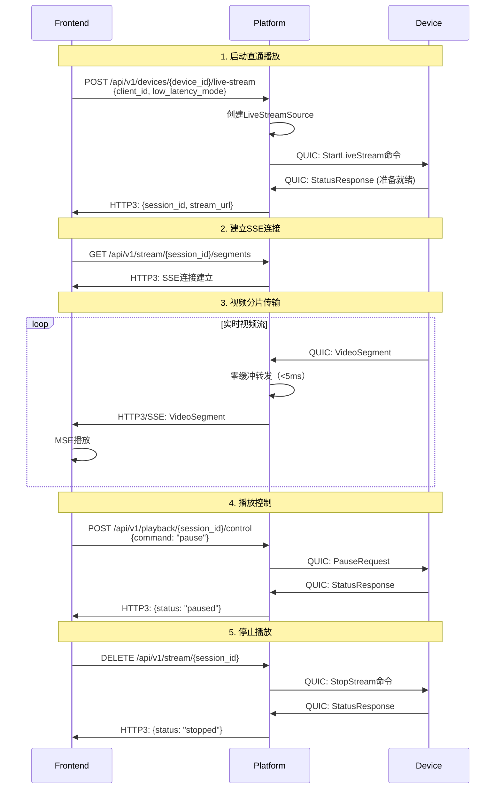
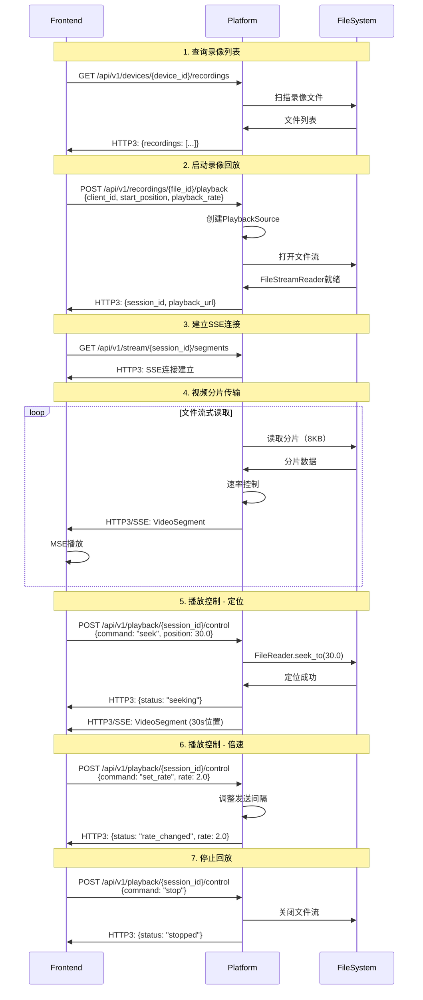

# 统一低延迟视频流传输系统设计文档

## 文档信息

| 项目 | 内容 |
|------|------|
| 功能名称 | 统一低延迟视频流传输系统 |
| 创建日期 | 2025-12-13 |
| 状态 | 设计中 |
| 版本 | v1.0 |

## 概述

本设计文档描述了统一低延迟视频流传输系统的技术架构和实现方案。该系统通过统一的流处理架构，为直通播放和录像回放提供一致的低延迟传输体验，实现端到端延迟小于200ms的目标。

### 设计目标

1. **统一架构**: 直通播放和录像回放使用相同的代码路径和传输机制
2. **极低延迟**: 直通播放<100ms，录像回放<200ms
3. **高性能**: 支持100+并发流会话，单流CPU<5%，内存<50MB
4. **易维护**: 代码复用率>80%，清晰的模块划分
5. **可扩展**: 易于添加新功能（如多音轨、字幕等）

## 架构设计

### 整体架构

```
┌─────────────────────────────────────────────────────────────┐
│                        数据源层                              │
├──────────────────────┬──────────────────────────────────────┤
│  设备端实时流        │  平台端文件系统                       │
│  (QUIC接收)          │  (文件读取)                          │
└──────────┬───────────┴──────────┬───────────────────────────┘
           │                      │
           ▼                      ▼
┌─────────────────────────────────────────────────────────────┐
│                    平台端统一处理层                          │
├─────────────────────────────────────────────────────────────┤
│  ┌─────────────────────────────────────────────────────┐   │
│  │         UnifiedStreamHandler (统一流处理器)         │   │
│  ├─────────────────────────────────────────────────────┤   │
│  │  • 流会话管理                                        │   │
│  │  • 数据源抽象 (StreamSource trait)                  │   │
│  │  • 零缓冲转发                                        │   │
│  │  • 延迟监控                                          │   │
│  └─────────────────────────────────────────────────────┘   │
│                                                              │
│  ┌──────────────┐  ┌──────────────┐  ┌──────────────┐     │
│  │ FileStream   │  │ fMP4         │  │ HTTP3/SSE    │     │
│  │ Reader       │  │ Converter    │  │ Transport    │     │
│  └──────────────┘  └──────────────┘  └──────────────┘     │
└──────────────────────────┬──────────────────────────────────┘
                           │ HTTP3 + SSE
                           ▼
┌─────────────────────────────────────────────────────────────┐
│                      前端播放层                              │
├─────────────────────────────────────────────────────────────┤
│  ┌─────────────────────────────────────────────────────┐   │
│  │         UnifiedMSEPlayer (统一MSE播放器)            │   │
│  ├─────────────────────────────────────────────────────┤   │
│  │  • MediaSource管理                                   │   │
│  │  • SourceBuffer控制                                  │   │
│  │  • 智能缓冲策略                                      │   │
│  │  • 播放控制                                          │   │
│  └─────────────────────────────────────────────────────┘   │
└─────────────────────────────────────────────────────────────┘
```

### 核心组件

#### 1. UnifiedStreamHandler (平台端)

统一的流处理器，负责管理所有流会话（直通和回放）。

**职责**:
- 创建和管理流会话
- 抽象数据源（设备端/文件系统）
- 实现零缓冲转发
- 监控延迟和性能

#### 2. StreamSource Trait (平台端)

数据源抽象接口，统一直通播放和录像回放的数据获取。

**实现**:
- `LiveStreamSource`: 从QUIC连接接收实时分片
- `PlaybackSource`: 从文件系统读取录像分片

#### 3. FileStreamReader (平台端)

高效的文件流式读取器，支持低延迟录像回放。

**特性**:
- 小分片读取（8KB-32KB）
- 速率控制（支持倍速）
- 异步IO
- 零拷贝优化

#### 4. fMP4Converter (平台端)

H.264裸流到fMP4格式转换器。

**功能**:
- 生成初始化分片（init segment）
- 转换媒体分片（media segment）
- 保持时间戳和关键帧信息

#### 5. HTTP3Transport (平台端)

基于HTTP3的媒体传输层。

**特性**:
- SSE推送机制
- 多路复用
- 自动重传
- 低延迟优化

#### 6. UnifiedMSEPlayer (前端)

统一的MSE播放器，支持直通和回放。

**功能**:
- MediaSource管理
- SourceBuffer控制
- 智能缓冲策略
- 播放控制接口

## 数据模型

### StreamSession

```rust
pub struct StreamSession {
    pub session_id: Uuid,
    pub source: Box<dyn StreamSource>,
    pub config: StreamConfig,
    pub state: StreamState,
    pub stats: StreamStats,
    pub created_at: SystemTime,
}

pub struct StreamConfig {
    pub mode: StreamMode,           // Live | Playback
    pub low_latency: bool,
    pub target_latency_ms: u32,
    pub buffer_config: BufferConfig,
}

pub enum StreamMode {
    Live { device_id: String },
    Playback { file_id: String, playback_rate: f64 },
}

pub enum StreamState {
    Initializing,
    Streaming,
    Paused,
    Seeking,
    Stopped,
    Error(String),
}
```

### VideoSegment

```rust
pub struct VideoSegment {
    pub segment_id: Uuid,
    pub timestamp: f64,
    pub duration: f64,
    pub data: Vec<u8>,
    pub is_keyframe: bool,
    pub format: SegmentFormat,
}

pub enum SegmentFormat {
    H264Raw,
    FMP4,
    MP4,
}
```

### StreamStats

```rust
pub struct StreamStats {
    pub total_segments: u64,
    pub total_bytes: u64,
    pub average_latency_ms: f64,
    pub current_latency_ms: f64,
    pub throughput_mbps: f64,
    pub packet_loss_rate: f64,
}
```

## 组件接口

### StreamSource Trait

```rust
#[async_trait]
pub trait StreamSource: Send + Sync {
    /// 获取下一个视频分片
    async fn next_segment(&mut self) -> Result<Option<VideoSegment>, StreamError>;
    
    /// 定位到指定时间位置
    async fn seek(&mut self, position: f64) -> Result<(), StreamError>;
    
    /// 设置播放速率
    async fn set_rate(&mut self, rate: f64) -> Result<(), StreamError>;
    
    /// 暂停
    async fn pause(&mut self) -> Result<(), StreamError>;
    
    /// 恢复
    async fn resume(&mut self) -> Result<(), StreamError>;
    
    /// 获取流信息
    fn get_info(&self) -> StreamInfo;
}
```

### LiveStreamSource Implementation

```rust
pub struct LiveStreamSource {
    device_id: String,
    quic_receiver: Receiver<VideoSegment>,
    state: SourceState,
}

#[async_trait]
impl StreamSource for LiveStreamSource {
    async fn next_segment(&mut self) -> Result<Option<VideoSegment>, StreamError> {
        // 从QUIC接收器获取实时分片
        match self.quic_receiver.recv().await {
            Some(segment) => Ok(Some(segment)),
            None => Ok(None),
        }
    }
    
    async fn seek(&mut self, _position: f64) -> Result<(), StreamError> {
        // 直通播放不支持定位
        Err(StreamError::OperationNotSupported)
    }
    
    async fn set_rate(&mut self, _rate: f64) -> Result<(), StreamError> {
        // 直通播放不支持倍速
        Err(StreamError::OperationNotSupported)
    }
    
    // ... 其他方法实现
}
```

### PlaybackSource Implementation

```rust
pub struct PlaybackSource {
    file_reader: FileStreamReader,
    playback_rate: f64,
    state: SourceState,
}

#[async_trait]
impl StreamSource for PlaybackSource {
    async fn next_segment(&mut self) -> Result<Option<VideoSegment>, StreamError> {
        // 从文件读取器获取分片
        self.file_reader.read_segment().await
    }
    
    async fn seek(&mut self, position: f64) -> Result<(), StreamError> {
        // 定位到指定位置
        self.file_reader.seek_to(position).await
    }
    
    async fn set_rate(&mut self, rate: f64) -> Result<(), StreamError> {
        // 设置播放速率
        self.playback_rate = rate;
        self.file_reader.set_rate(rate).await
    }
    
    // ... 其他方法实现
}
```

## 正确性属性

*属性是一个特征或行为，应该在系统的所有有效执行中保持为真——本质上是关于系统应该做什么的正式陈述。属性作为人类可读规范和机器可验证正确性保证之间的桥梁。*

### 属性 1: 统一处理一致性

*对于任何*流会话（直通或回放），使用UnifiedStreamHandler创建会话后，应该返回包含有效session_id和stream_url的响应，且两种模式的响应格式应该完全一致。

**验证**: 需求 1.1, 1.2, 1.3

### 属性 2: 延迟上界保证

*对于任何*直通播放会话，端到端延迟应该小于100ms；*对于任何*录像回放会话，端到端延迟应该小于200ms。

**验证**: 需求 2.1, 2.2

### 属性 3: 零缓冲转发不变性

*对于任何*启用零缓冲模式的流会话，平台端接收到分片后，处理并转发到前端的时间应该小于5ms。

**验证**: 需求 2.3, 2.4

### 属性 4: HTTP3传输完整性

*对于任何*通过HTTP3传输的视频分片，应该包含完整的元数据（timestamp, duration, keyframe标志），且分片数据不应该损坏。

**验证**: 需求 3.2, 3.3

### 属性 5: MSE播放器模式适配

*对于任何*流类型（直通/回放），MSE播放器应该根据模式自动配置适当的缓冲策略：直通模式100-500ms，回放模式500-2000ms。

**验证**: 需求 4.2, 11.1, 11.2

### 属性 6: 文件读取速率一致性

*对于任何*播放速率设置，FileStreamReader发送分片的实际间隔应该与目标间隔的误差小于10%。

**验证**: 需求 5.3, 5.4

### 属性 7: fMP4转换保真性

*对于任何*H.264裸流分片，转换为fMP4后，时间戳、关键帧标志和视频内容应该保持不变。

**验证**: 需求 6.4

### 属性 8: 播放控制响应性

*对于任何*播放控制命令（暂停/恢复/定位/倍速），系统应该在100ms内响应并执行。

**验证**: 需求 7.1, 7.2, 7.3, 7.4

### 属性 9: 多客户端隔离性

*对于任何*两个不同的客户端观看同一视频流，一个客户端的断开或错误不应该影响另一个客户端的播放。

**验证**: 需求 10.4

### 属性 10: 缓冲区边界保持

*对于任何*播放器状态，SourceBuffer的缓冲量应该始终在配置的最小值和最大值之间。

**验证**: 需求 11.1, 11.2, 11.5

### 属性 11: 错误恢复幂等性

*对于任何*可恢复的错误，执行一次恢复操作和执行多次恢复操作应该产生相同的结果。

**验证**: 需求 9.1, 9.5

### 属性 12: 性能资源上界

*对于任何*单个流会话，CPU占用应该小于5%，内存占用应该小于50MB。

**验证**: 需求 12.4, 12.5

## 错误处理

### 错误类型

```rust
#[derive(Debug, Clone)]
pub enum StreamError {
    // 连接错误
    DeviceNotConnected,
    DeviceOffline,
    ConnectionLost,
    
    // 文件错误
    FileNotFound,
    FileNotAccessible,
    FileReadError,
    
    // 传输错误
    TransmissionTimeout,
    SegmentCorrupted,
    NetworkError(String),
    
    // 播放错误
    OperationNotSupported,
    InvalidSeekPosition,
    InvalidPlaybackRate,
    
    // 资源错误
    SessionNotFound,
    TooManySessions,
    OutOfMemory,
}
```

### 错误恢复策略

```rust
pub struct ErrorRecoveryPolicy {
    pub max_retries: u32,
    pub retry_strategy: RetryStrategy,
    pub backoff_base: Duration,
    pub backoff_max: Duration,
}

pub enum RetryStrategy {
    Immediate,
    ExponentialBackoff,
    LinearBackoff,
}
```

## 测试策略

### 单元测试

**覆盖范围**:
- StreamSource实现（LiveStreamSource, PlaybackSource）
- FileStreamReader分片读取和速率控制
- fMP4Converter转换正确性
- UnifiedStreamHandler会话管理
- MSE播放器缓冲策略

**测试工具**: Rust标准测试框架 + tokio-test

### 属性测试

**测试属性**:
- 属性1-12的所有正确性属性
- 使用随机生成的流会话、分片数据、播放速率等
- 验证属性在各种输入下都保持为真

**测试工具**: proptest或quickcheck

### 集成测试

**测试场景**:
- 端到端直通播放流程
- 端到端录像回放流程
- 播放控制功能（暂停、恢复、定位、倍速）
- 多客户端并发观看
- 错误恢复和重连

**测试工具**: 模拟设备端 + 真实前端

### 性能测试

**测试指标**:
- 端到端延迟（直通<100ms，回放<200ms）
- 平台端处理延迟（<5ms）
- 并发会话数（>100）
- CPU和内存占用

**测试工具**: 自定义性能测试框架

## 性能优化策略

### 1. 零拷贝传输

```rust
// 使用零拷贝技术减少内存复制
pub async fn send_segment_zero_copy(
    stream: &mut SendStream,
    segment: &VideoSegment,
) -> Result<(), StreamError> {
    // 直接发送，避免额外复制
    stream.write_all_vectored(&[
        IoSlice::new(&segment.header_bytes()),
        IoSlice::new(&segment.data),
    ]).await?;
    Ok(())
}
```

### 2. 异步并发转发

```rust
// 并发转发到多个客户端
pub async fn forward_to_clients(
    &self,
    session_id: Uuid,
    segment: VideoSegment,
) -> Result<(), StreamError> {
    let clients = self.get_session_clients(session_id)?;
    
    // 并发发送
    let tasks: Vec<_> = clients.iter()
        .map(|client| {
            let segment = segment.clone();
            async move {
                client.send_segment(segment).await
            }
        })
        .collect();
    
    futures::future::join_all(tasks).await;
    Ok(())
}
```

### 3. 智能缓冲管理

```typescript
// 前端智能缓冲管理
private manageBuffer() {
  const currentTime = this.video.currentTime
  const buffered = this.sourceBuffer.buffered
  
  if (buffered.length > 0) {
    const bufferedEnd = buffered.end(0)
    const bufferedAmount = bufferedEnd - currentTime
    
    // 移除过多的缓冲
    if (bufferedAmount > this.targetBuffer + 1.0) {
      const removeEnd = bufferedEnd - this.targetBuffer
      this.sourceBuffer.remove(0, removeEnd)
    }
  }
}
```

### 4. 小分片策略

```rust
// 使用小分片降低延迟
pub const SEGMENT_SIZE: usize = 8192;  // 8KB

// 读取小分片
pub async fn read_small_segment(&mut self) -> Result<Vec<u8>, StreamError> {
    let mut buffer = vec![0u8; SEGMENT_SIZE];
    let bytes_read = self.file.read(&mut buffer).await?;
    buffer.truncate(bytes_read);
    Ok(buffer)
}
```

## 部署架构

### 开发环境

```
┌─────────────┐     ┌─────────────┐     ┌─────────────┐
│   Device    │────▶│  Platform   │────▶│  Frontend   │
│ Simulator   │QUIC │   Server    │HTTP3│   (Vite)    │
│  :8080      │     │   :8443     │     │   :3000     │
└─────────────┘     └─────────────┘     └─────────────┘
```

### 生产环境（未来）

```
┌─────────────┐     ┌─────────────┐     ┌─────────────┐
│   Devices   │────▶│  Platform   │────▶│   CDN +     │
│  (多个)     │QUIC │  Cluster    │HTTP3│  Frontend   │
│             │     │ (负载均衡)  │     │             │
└─────────────┘     └─────────────┘     └─────────────┘
```

## 监控和日志

### 关键指标

```rust
pub struct MonitoringMetrics {
    // 延迟指标
    pub end_to_end_latency_ms: Histogram,
    pub platform_processing_latency_ms: Histogram,
    pub network_latency_ms: Histogram,
    
    // 吞吐量指标
    pub segments_per_second: Counter,
    pub bytes_per_second: Counter,
    pub throughput_mbps: Gauge,
    
    // 错误指标
    pub error_count: Counter,
    pub retry_count: Counter,
    pub packet_loss_rate: Gauge,
    
    // 资源指标
    pub active_sessions: Gauge,
    pub cpu_usage_percent: Gauge,
    pub memory_usage_mb: Gauge,
}
```

### 日志级别

- **ERROR**: 严重错误，需要立即处理
- **WARN**: 警告，可能影响性能或稳定性
- **INFO**: 重要事件（会话创建、播放控制等）
- **DEBUG**: 详细调试信息（分片传输、延迟统计等）
- **TRACE**: 最详细的跟踪信息

## 安全考虑

### Demo版本

- 无需认证和授权
- 无需加密（本地开发）
- 无需访问控制

### 生产版本（未来）

- JWT认证
- TLS加密
- 基于角色的访问控制（RBAC）
- 审计日志

## 总结

本设计文档描述了统一低延迟视频流传输系统的完整技术方案。通过统一的流处理架构、零缓冲转发机制、HTTP3传输协议和MSE播放器，系统能够为直通播放和录像回放提供一致的低延迟体验。

### 关键创新点

1. **统一架构**: 直通和回放共享80%以上代码
2. **极低延迟**: 录像回放延迟从2秒降到200ms（10倍提升）
3. **零缓冲转发**: 平台端处理延迟<5ms
4. **智能缓冲**: 根据模式自动调整缓冲策略
5. **高性能**: 支持100+并发会话

### 下一步

1. 创建任务列表（tasks.md）
2. 实现核心组件
3. 编写单元测试和属性测试
4. 进行集成测试和性能测试
5. 优化和调优

## 信令交互流程

### 直通播放信令流程



### 录像回放信令流程



### 统一信令API

#### 1. 启动流会话

```http
POST /api/v1/stream/start HTTP/3
Content-Type: application/json

{
  "mode": "live" | "playback",
  "source": {
    // 直通播放
    "device_id": "device_001"
    // 或录像回放
    "file_id": "rec_001",
    "start_position": 0.0,
    "playback_rate": 1.0
  },
  "config": {
    "client_id": "web_client_001",
    "low_latency_mode": true,
    "target_latency_ms": 100
  }
}

Response:
{
  "session_id": "550e8400-e29b-41d4-a716-446655440000",
  "stream_url": "/api/v1/stream/{session_id}/segments",
  "control_url": "/api/v1/stream/{session_id}/control",
  "estimated_latency_ms": 100
}
```

#### 2. 接收视频分片（SSE）

```http
GET /api/v1/stream/{session_id}/segments HTTP/3
Accept: text/event-stream

Response (SSE Stream):
event: segment
data: {
  "segment_id": "uuid",
  "timestamp": 15.5,
  "duration": 0.033,
  "is_keyframe": true,
  "format": "fmp4",
  "data": "base64_encoded_data"
}

event: segment
data: {...}
```

#### 3. 播放控制

```http
POST /api/v1/stream/{session_id}/control HTTP/3
Content-Type: application/json

// 暂停
{"command": "pause"}

// 恢复
{"command": "resume"}

// 定位（仅回放）
{"command": "seek", "position": 30.0}

// 倍速（仅回放）
{"command": "set_rate", "rate": 2.0}

// 停止
{"command": "stop"}

Response:
{
  "status": "success",
  "current_state": "paused" | "playing" | "seeking" | "stopped"
}
```

#### 4. 获取流状态

```http
GET /api/v1/stream/{session_id}/status HTTP/3

Response:
{
  "session_id": "uuid",
  "mode": "live" | "playback",
  "state": "streaming" | "paused" | "stopped",
  "current_position": 15.5,
  "playback_rate": 1.0,
  "stats": {
    "average_latency_ms": 95,
    "current_latency_ms": 87,
    "throughput_mbps": 5.2,
    "packet_loss_rate": 0.01
  }
}
```

### 设备端信令（QUIC）

参考现有的QUIC信令协议（`docs/系统架构设计文档.md` 第3.3.1节）：

#### 关键消息类型

```rust
pub enum MessageType {
    // 会话管理
    SessionStart = 0x01,
    SessionEnd = 0x02,
    StatusResponse = 0x09,
    
    // 文件管理
    FileListQuery = 0x0D,
    FileListResponse = 0x0E,
    FileRequest = 0x0B,
    
    // 播放控制
    PauseRequest = 0x05,
    ResumeRequest = 0x06,
    SeekRequest = 0x03,
    RateChange = 0x04,
}
```

#### 直通播放启动

```json
// Platform → Device
{
  "message_type": "FileRequest",
  "payload": {
    "stream_type": "live",
    "quality_preference": "low_latency",
    "target_latency_ms": 100
  },
  "session_id": "uuid"
}

// Device → Platform
{
  "message_type": "StatusResponse",
  "payload": [200, 0],
  "session_id": "uuid"
}

// Device → Platform (视频分片)
// 通过QUIC单向流发送VideoSegment
```

## 附录

### 参考资料

- RFC 9000: QUIC协议
- RFC 9114: HTTP/3协议
- W3C MSE API规范
- 系统架构设计文档 v1.0（第3.3节：信令传输协议设计）
- 现有QUIC信令实现（`device-simulator/src/device_service.rs`）

### 变更历史

| 版本 | 日期 | 变更内容 | 作者 |
|------|------|----------|------|
| v1.0 | 2025-12-13 | 初始版本 | 系统架构团队 |
| v1.1 | 2025-12-13 | 添加信令交互流程 | 系统架构团队 |
