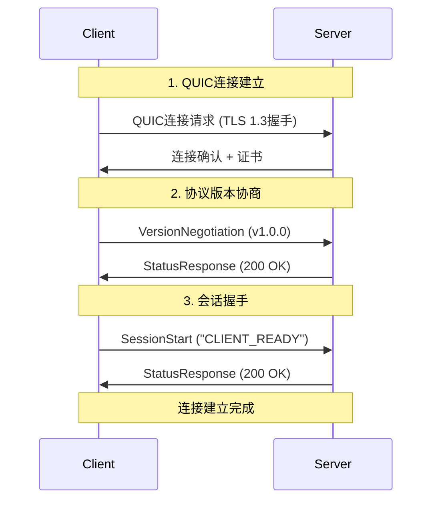
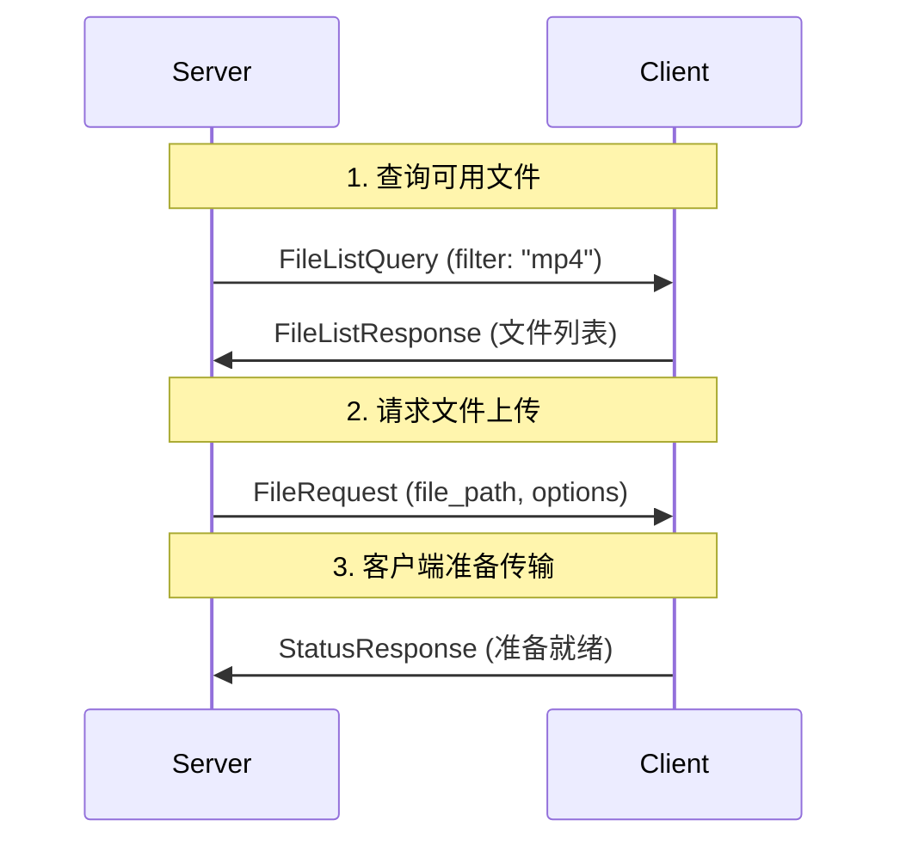
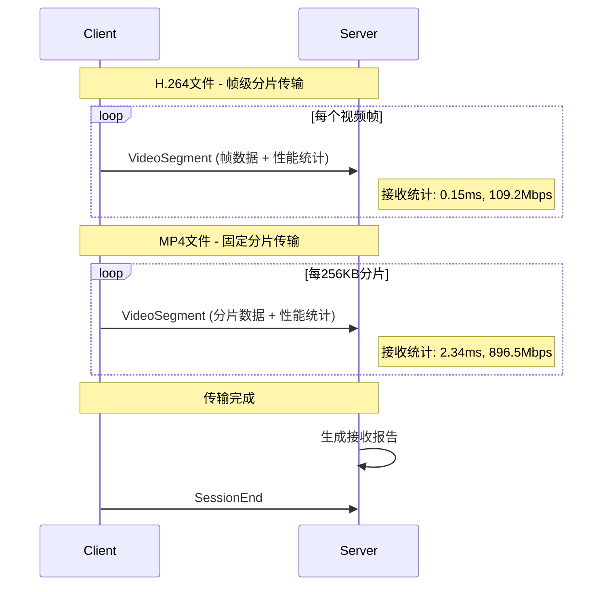
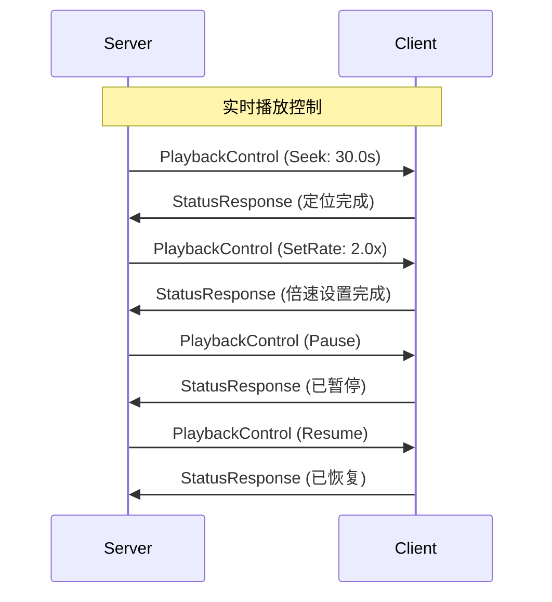
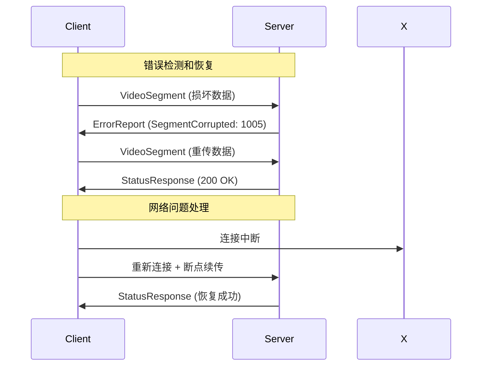

# 视频流上传系统平台集成协议规范 v1.0.0

## 概述

本文档描述了视频流上传系统的完整协议规范，供平台端开发者实现与客户端的交互。系统基于QUIC协议实现极低延迟、高可靠性的视频流传输，支持帧级分片和实时播放控制。

## 系统架构

### 核心组件
- **客户端 (Client)**: 视频文件持有方，响应平台请求进行按需上传
- **平台服务器 (Platform Server)**: 主动请求视频文件，接收并处理上传的视频流
- **QUIC传输层**: 提供加密、多路复用、极低延迟的网络传输

### 交互模式
- **按需上传**: 平台主动请求，客户端响应上传
- **实时控制**: 支持播放控制（SEEK、倍速、暂停/恢复）
- **极低延迟传输**: 帧级分片，最大速度传输，适合实时流媒体
- **智能分片策略**: H.264帧级分片，MP4固定分片，通用文件批量传输

### 性能特性
- **H.264文件**: 真正的帧级分片，极低延迟模式
- **MP4文件**: 256KB固定分片，高吞吐量模式  
- **通用文件**: 512KB分片，兼容性模式
- **传输速度**: 最大网络带宽利用，无人为延迟
- **实时监控**: 分片级性能统计和端到端监控

## 网络协议

### QUIC配置
```
协议: QUIC over UDP
加密: TLS 1.3 (自签名证书用于开发)
ALPN: "video-streaming/1.0"
端口: 8080 (默认)
证书验证: 开发环境跳过验证
```

### 连接参数
```rust
QUICOptions {
    max_concurrent_streams: 100,              // 支持100个并发流
    initial_max_data: 50 * 1024 * 1024,      // 50MB - 支持大文件传输
    initial_max_stream_data: 5 * 1024 * 1024, // 5MB - 支持大分片传输
    idle_timeout: 30秒,                       // 连接空闲超时
    keep_alive_interval: 5秒,                 // 保活间隔
}
```

### 传输优化配置
```rust
// 音频流配置 (低延迟优先)
StreamConfig {
    stream_type: Audio,
    priority: 255,                    // 最高优先级
    max_data_rate: 320_000,          // 320 kbps
    buffer_size: 4096,               // 4KB 小缓冲区
    congestion_control: LowLatency,   // 低延迟拥塞控制
}

// 视频流配置 (高吞吐量优先)  
StreamConfig {
    stream_type: Video,
    priority: 128,                    // 中等优先级
    max_data_rate: 10_000_000,       // 10 Mbps
    buffer_size: 65536,              // 64KB 大缓冲区
    congestion_control: HighThroughput, // 高吞吐量拥塞控制
}
```

## 协议消息格式

### 基础消息结构
所有协议消息均采用JSON序列化，通过QUIC单向流传输：

```json
{
  "message_type": "消息类型枚举值",
  "payload": "Base64编码的载荷数据",
  "sequence_number": "消息序列号(u64)",
  "timestamp": "ISO8601时间戳",
  "session_id": "会话UUID"
}
```

### 二进制消息格式
协议消息在网络传输时使用优化的二进制格式：

```
[1字节]  消息类型: MessageType枚举值
[8字节]  序列号: u64大端序
[8字节]  时间戳: Unix毫秒时间戳，u64大端序
[4字节]  载荷长度: u32大端序
[N字节]  载荷数据: 实际消息内容
```

### 消息类型定义

#### 完整消息类型枚举
```rust
enum MessageType {
    SessionStart = 0x01,           // 会话开始
    SessionEnd = 0x02,             // 会话结束
    SeekRequest = 0x03,            // 定位请求
    RateChange = 0x04,             // 播放速率变更
    PauseRequest = 0x05,           // 暂停请求
    ResumeRequest = 0x06,          // 恢复请求
    ErrorReport = 0x07,            // 错误报告
    StatsRequest = 0x08,           // 统计请求
    StatusResponse = 0x09,         // 状态响应
    VersionNegotiation = 0x0A,     // 版本协商
    FileRequest = 0x0B,            // 文件请求
    PlaybackControl = 0x0C,        // 播放控制
    FileListQuery = 0x0D,          // 文件列表查询
    FileListResponse = 0x0E,       // 文件列表响应
}
```

#### 1. 会话管理消息

**SessionStart (0x01) - 会话开始**
```json
{
  "message_type": "SessionStart",
  "payload": "Q0xJRU5UX1JFQURZ",  // "CLIENT_READY"
  "sequence_number": 1,
  "timestamp": "2025-12-11T01:16:25Z",
  "session_id": "550e8400-e29b-41d4-a716-446655440000"
}
```

**SessionEnd (0x02) - 会话结束**
```json
{
  "message_type": "SessionEnd",
  "payload": "",
  "sequence_number": 999,
  "timestamp": "2025-12-11T01:20:30Z",
  "session_id": "550e8400-e29b-41d4-a716-446655440000"
}
```

**VersionNegotiation (0x0A) - 协议版本协商**
```json
{
  "message_type": "VersionNegotiation",
  "payload": "AQAAAgAA",  // [1,0,0] = v1.0.0
  "sequence_number": 1,
  "timestamp": "2025-12-11T01:16:25Z",
  "session_id": "550e8400-e29b-41d4-a716-446655440000"
}
```

载荷格式（3字节）：
```
[1字节] 主版本号 (major)
[1字节] 次版本号 (minor)  
[1字节] 补丁版本号 (patch)
```

**StatusResponse (0x09) - 状态响应**
```json
{
  "message_type": "StatusResponse",
  "payload": "yAA=",  // [200, 0] = HTTP 200 OK
  "sequence_number": 2,
  "timestamp": "2025-12-11T01:16:26Z",
  "session_id": "550e8400-e29b-41d4-a716-446655440000"
}
```

载荷格式：
```
[2字节] 状态码: u16大端序
[N字节] 可选状态消息: UTF-8字符串
```

状态码定义：
```rust
enum StatusCode {
    Success = 200,
    BadRequest = 400,
    Unauthorized = 401,
    NotFound = 404,
    InternalError = 500,
    ServiceUnavailable = 503,
    UnsupportedFormat = 1001,
    InsufficientBandwidth = 1002,
    StorageFull = 1003,
    AuthenticationFailed = 1004,
    SegmentCorrupted = 1005,
}
```

**ErrorReport (0x07) - 错误报告**
```json
{
  "message_type": "ErrorReport",
  "payload": "Base64编码的错误信息",
  "sequence_number": 100,
  "timestamp": "2025-12-11T01:18:00Z",
  "session_id": "550e8400-e29b-41d4-a716-446655440000"
}
```

载荷格式：
```json
{
  "error_code": 1001,
  "error_message": "Unsupported file format: .avi",
  "retry_after": 5000,  // 可选，毫秒
  "details": {
    "file_path": "test.avi",
    "supported_formats": ["mp4", "h264"]
  }
}
```

#### 2. 文件管理消息

**FileListQuery (0x0D) - 查询文件列表**
```json
{
  "message_type": "FileListQuery",
  "payload": "eyJmaWx0ZXIiOiAibXA0In0=",  // {"filter": "mp4"}
  "sequence_number": 2,
  "timestamp": "2025-12-11T01:16:30Z",
  "session_id": "550e8400-e29b-41d4-a716-446655440000"
}
```

载荷格式：
```json
{
  "filter": "可选的文件过滤器字符串，支持格式名或路径匹配"
}
```

**FileListResponse (0x0E) - 文件列表响应**
```json
{
  "message_type": "FileListResponse",
  "payload": "Base64编码的文件列表",
  "sequence_number": 3,
  "timestamp": "2025-12-11T01:16:31Z",
  "session_id": "550e8400-e29b-41d4-a716-446655440000"
}
```

载荷格式：
```json
{
  "files": [
    {
      "file_path": "test_videos/video1.mp4",
      "file_size": 1048576,
      "duration": 60.5,
      "format": "mp4",
      "available": true,
      "resolution": {
        "width": 1920,
        "height": 1080,
        "aspect_ratio": "16:9"
      },
      "codec": {
        "video": "H.264",
        "audio": "AAC"
      },
      "frame_rate": 30.0,
      "bit_rate": 5000000,
      "checksum": "sha256:abc123..."
    }
  ]
}
```

**FileRequest (0x0B) - 请求文件上传**
```json
{
  "message_type": "FileRequest",
  "payload": "Base64编码的文件请求",
  "sequence_number": 4,
  "timestamp": "2025-12-11T01:16:35Z",
  "session_id": "550e8400-e29b-41d4-a716-446655440000"
}
```

载荷格式：
```json
{
  "file_path": "test_videos/video1.mp4",
  "priority": 1,                    // 1-255，数值越高优先级越高
  "seek_position": 30.0,            // 可选，从30秒开始
  "playback_rate": 1.0,             // 播放倍速，0.25-4.0
  "quality_preference": "low_latency", // "low_latency" | "high_quality" | "balanced"
  "segment_mode": "frame",          // "frame" | "gop" | "time" | "auto"
  "max_bandwidth": 10000000,        // 可选，最大带宽限制(bps)
  "resume_from_segment": null       // 可选，断点续传的分片ID
}
```

#### 3. 播放控制消息

**PlaybackControl (0x0C) - 播放控制**
```json
{
  "message_type": "PlaybackControl",
  "payload": "Base64编码的控制命令",
  "sequence_number": 5,
  "timestamp": "2025-12-11T01:17:00Z",
  "session_id": "550e8400-e29b-41d4-a716-446655440000"
}
```

载荷格式（支持多种控制命令）：
```json
// SEEK命令 - 跳转到指定时间位置
{
  "Seek": {
    "position": 45.5,              // 目标时间位置（秒）
    "accurate": true,              // 是否精确定位到关键帧
    "resume_after_seek": true      // 定位后是否自动恢复播放
  }
}

// 倍速控制 - 改变播放速率
{
  "SetRate": {
    "rate": 2.0,                   // 播放倍速，支持0.25-4.0
    "smooth_transition": true,     // 是否平滑过渡
    "maintain_audio": false        // 高倍速时是否保持音频
  }
}

// 暂停播放
{
  "Pause": {
    "reason": "user_request",      // 暂停原因："user_request" | "buffering" | "error"
    "preserve_position": true      // 是否保持当前播放位置
  }
}

// 恢复播放
{
  "Resume": {
    "from_position": null,         // 可选，指定恢复位置
    "fade_in": false              // 是否淡入恢复
  }
}

// 停止播放
{
  "Stop": {
    "reason": "user_request",      // 停止原因
    "cleanup_resources": true,     // 是否清理资源
    "send_statistics": true       // 是否发送统计信息
  }
}

// 质量调整
{
  "AdjustQuality": {
    "target_bitrate": 5000000,     // 目标比特率
    "max_resolution": "1080p",     // 最大分辨率
    "adaptive": true              // 是否自适应调整
  }
}

// 缓冲控制
{
  "BufferControl": {
    "target_buffer_size": 30.0,    // 目标缓冲时长（秒）
    "max_buffer_size": 60.0,       // 最大缓冲时长
    "prebuffer_duration": 5.0      // 预缓冲时长
  }
}
```

**SeekRequest (0x03) - 独立定位请求**
```json
{
  "message_type": "SeekRequest",
  "payload": "Base64编码的定位请求",
  "sequence_number": 6,
  "timestamp": "2025-12-11T01:17:30Z",
  "session_id": "550e8400-e29b-41d4-a716-446655440000"
}
```

载荷格式：
```json
{
  "target_position": 120.5,        // 目标时间位置（秒）
  "seek_type": "keyframe",         // "keyframe" | "exact" | "fast"
  "direction": "forward",          // "forward" | "backward" | "nearest"
  "max_seek_time": 2.0            // 最大定位耗时（秒）
}
```

**RateChange (0x04) - 独立速率变更**
```json
{
  "message_type": "RateChange", 
  "payload": "Base64编码的速率变更",
  "sequence_number": 7,
  "timestamp": "2025-12-11T01:17:45Z",
  "session_id": "550e8400-e29b-41d4-a716-446655440000"
}
```

载荷格式：
```json
{
  "new_rate": 1.5,                // 新的播放倍速
  "transition_duration": 1.0,     // 过渡时长（秒）
  "audio_handling": "pitch_preserve" // "pitch_preserve" | "mute" | "normal"
}
```

## 视频分片传输协议

### 智能分片策略

系统根据文件格式自动选择最优分片策略：

#### H.264文件 - 帧级分片（极低延迟模式）
- **分片方式**: 真正的NAL单元解析，帧边界分片
- **分片大小**: 变长（实际帧大小）
- **传输间隔**: 最大速度传输，无人为延迟
- **关键帧检测**: IDR、SPS、PPS帧自动识别
- **编码参数保持**: 提取并保持原始H.264编码参数
- **适用场景**: 实时流媒体，低延迟应用

#### MP4文件 - 固定分片（高吞吐量模式）
- **分片方式**: 256KB固定大小分片
- **传输间隔**: 最大速度传输，无人为延迟
- **优化目标**: 高可靠性和吞吐量
- **避免问题**: 不进行复杂音视频分离，减少stream too long错误
- **适用场景**: 文件传输，大容量视频

#### 通用文件 - 批量传输（兼容性模式）
- **分片方式**: 512KB固定分片
- **传输间隔**: 批量高速传输
- **适用场景**: 未知格式文件

### 分片数据格式

客户端将视频文件分片后通过QUIC流传输，每个分片包含完整的协议头：

#### 视频分片格式 (总计42字节头部)
```
[1字节]  流类型标识符: 0x01 (视频)
[16字节] 分片ID: UUID字节数组 (RFC 4122)
[8字节]  时间戳: f64大端序 (秒，相对于文件开始)
[8字节]  持续时间: f64大端序 (秒，分片时长)
[4字节]  帧数量: u32大端序 (此分片包含的帧数)
[1字节]  标志位: 位掩码
         - 0x01: 关键帧标志
         - 0x02: 序列参数集(SPS)标志
         - 0x04: 图像参数集(PPS)标志
         - 0x08: 即时解码刷新(IDR)标志
         - 0x10: 分片结束标志
         - 0x20: 错误恢复标志
         - 0x40: 优先级标志
         - 0x80: 保留位
[4字节]  数据长度: u32大端序 (实际视频数据字节数)
[N字节]  实际视频数据: 原始视频帧数据
```

#### 音频分片格式 (总计43字节头部)
```
[1字节]  流类型标识符: 0x02 (音频)
[16字节] 分片ID: UUID字节数组
[8字节]  时间戳: f64大端序 (秒，相对于文件开始)
[8字节]  持续时间: f64大端序 (秒，音频帧时长)
[4字节]  采样率: u32大端序 (Hz，如44100)
[2字节]  声道数: u16大端序 (1=单声道, 2=立体声)
[4字节]  数据长度: u32大端序 (实际音频数据字节数)
[N字节]  实际音频数据: 原始音频帧数据
```

#### 扩展元数据格式 (可选)
对于需要额外元数据的分片，可在数据部分前添加：

```
[2字节]  元数据长度: u16大端序
[N字节]  元数据: JSON格式的扩展信息
```

元数据示例：
```json
{
  "codec": "h264",
  "profile": "High",
  "level": "4.1",
  "resolution": "1920x1080",
  "frame_rate": 30.0,
  "bit_rate": 5000000,
  "encoding_params": {
    "constraint_set0_flag": true,
    "chroma_format_idc": "1",
    "bit_depth_luma_minus8": "0"
  },
  "quality_preserved": true,
  "segment_mode": "frame_level"
}
```

### 性能监控数据

每个分片传输都包含性能统计信息：

#### 发送端统计
```
发送日志格式:
Transmitted H.264 frame 1/150 (2048 bytes, KEY, 0.15ms, 109.2Mbps) for session abc123

字段说明:
- H.264 frame: 分片类型和格式
- 1/150: 当前分片/总分片数
- 2048 bytes: 分片大小
- KEY/P/B: 帧类型（关键帧/P帧/B帧）
- 0.15ms: 实际传输耗时
- 109.2Mbps: 瞬时传输速率
- abc123: 会话ID
```

#### 接收端统计
```
接收日志格式:
Received video segment 2.567s (2048 bytes, 0.15ms, 109.2Mbps) to file.mp4

字段说明:
- video segment: 分片类型
- 2.567s: 分片时间戳（用于播放同步）
- 2048 bytes: 分片大小
- 0.15ms: 实际接收耗时
- 109.2Mbps: 接收吞吐量
- file.mp4: 输出文件路径
```

### 传输完成统计

#### 发送端完成报告
```
H.264 frame-level transmission completed for session abc123 
(150 frames, 1048576 bytes, 0.89s, avg 5.93ms/frame, 9.4Mbps overall, 109.2Mbps peak)

统计说明:
- 150 frames: 总帧数
- 1048576 bytes: 总传输字节数
- 0.89s: 实际传输耗时
- avg 5.93ms/frame: 平均每帧传输时间
- 9.4Mbps overall: 总体传输速率
- 109.2Mbps peak: 峰值传输速率
```

#### 接收端完成报告
```
File reception completed for session abc123
Received: 1048576 bytes in 2.45s (actual reception: 0.89s)
Segments: 150 total (150 video, 0 audio)
Performance: 9.4Mbps overall, 109.2Mbps peak, avg 5.93ms/segment
Files: video.mp4 (playable), debug.txt (statistics), report.txt (summary)

性能指标:
- 总耗时 vs 实际接收耗时: 评估传输密度
- 总体速率 vs 峰值速率: 评估网络性能
- 平均分片时间: 评估网络稳定性
- 接收效率: 实际接收时间/总时间比例
```

## 平台端实现指南

### 1. 服务器启动和配置

```rust
use quinn::{ServerConfig, Endpoint};
use rustls::{Certificate, PrivateKey, ServerConfig as TlsServerConfig};
use std::sync::Arc;

// 创建服务器配置
async fn create_server() -> Result<MockPlatformServer, TransportError> {
    let mut server = MockPlatformServer::new()?;
    
    // 启动服务器监听
    let bind_addr = "127.0.0.1:8080".parse().unwrap();
    server.start(bind_addr).await?;
    
    info!("Platform server started on {}", bind_addr);
    Ok(server)
}

// 创建QUIC服务器配置
fn create_server_config() -> Result<ServerConfig, TransportError> {
    // 创建自签名证书用于开发
    let cert = rcgen::generate_simple_self_signed(vec!["localhost".into()])?;
    let cert_der = cert.serialize_der()?;
    let priv_key = cert.serialize_private_key_der();

    let mut tls_config = TlsServerConfig::builder()
        .with_safe_defaults()
        .with_no_client_auth()
        .with_single_cert(
            vec![Certificate(cert_der)],
            PrivateKey(priv_key),
        )?;

    // 配置ALPN协议标识
    tls_config.alpn_protocols = vec![b"video-streaming/1.0".to_vec()];

    let mut server_config = ServerConfig::with_crypto(Arc::new(tls_config));
    let transport_config = Arc::get_mut(&mut server_config.transport).unwrap();
    
    // 配置传输参数以支持大分片传输
    transport_config.max_concurrent_uni_streams(100_u32.into());
    transport_config.max_concurrent_bidi_streams(10_u32.into());
    transport_config.stream_receive_window((5 * 1024 * 1024u32).try_into().unwrap()); // 5MB per stream
    transport_config.receive_window((50 * 1024 * 1024u32).try_into().unwrap()); // 50MB total
    transport_config.max_idle_timeout(Some(std::time::Duration::from_secs(30).try_into().unwrap()));

    Ok(server_config)
}
```

### 2. 连接处理和会话管理

```rust
// 处理传入连接
async fn handle_connections(
    endpoint: Endpoint,
    sessions: Arc<Mutex<HashMap<Uuid, ServerSession>>>,
    file_registry: Arc<Mutex<HashMap<String, FileInfo>>>,
) {
    while let Some(conn) = endpoint.accept().await {
        let sessions = sessions.clone();
        let file_registry = file_registry.clone();
        
        tokio::spawn(async move {
            if let Err(e) = handle_connection(conn, sessions, file_registry).await {
                error!("Connection handling error: {}", e);
            }
        });
    }
}

// 处理单个连接
async fn handle_connection(
    connecting: quinn::Connecting,
    sessions: Arc<Mutex<HashMap<Uuid, ServerSession>>>,
    file_registry: Arc<Mutex<HashMap<String, FileInfo>>>,
) -> Result<(), TransportError> {
    let connection = connecting.await?;
    let session_id = Uuid::new_v4();
    
    info!("New client connection established: {}", session_id);

    // 创建会话信息
    let session = ServerSession {
        id: session_id,
        connection: QUICConnection {
            id: session_id,
            remote_address: connection.remote_address(),
            established_at: std::time::SystemTime::now(),
            stats: ConnectionStats {
                rtt: std::time::Duration::from_millis(10),
                bandwidth: 10_000_000, // 10 Mbps初始估计
                packet_loss: 0.0,
                congestion_window: 65536,
            },
            inner: Arc::new(connection.clone()),
            config: QUICOptions {
                max_concurrent_streams: 100,
                initial_max_data: 50 * 1024 * 1024,
                initial_max_stream_data: 5 * 1024 * 1024,
                idle_timeout: std::time::Duration::from_secs(30),
            },
        },
        requested_files: Vec::new(),
        active_streams: HashMap::new(),
        received_segments: Vec::new(),
        status: SessionStatus::Connected,
        current_file: None,
    };

    sessions.lock().await.insert(session_id, session);

    // 处理连接上的流
    loop {
        match connection.accept_uni().await {
            Ok(recv_stream) => {
                let sessions = sessions.clone();
                tokio::spawn(async move {
                    if let Err(e) = handle_stream(session_id, recv_stream, sessions).await {
                        error!("Stream handling error: {}", e);
                    }
                });
            }
            Err(quinn::ConnectionError::ApplicationClosed { .. }) => {
                info!("Client {} disconnected", session_id);
                break;
            }
            Err(e) => {
                error!("Connection error: {}", e);
                break;
            }
        }
    }

    // 清理会话
    sessions.lock().await.remove(&session_id);
    Ok(())
}
```

### 3. 流处理和消息解析

```rust
// 处理数据流（协议消息和分片数据）
async fn handle_stream(
    session_id: Uuid,
    mut recv_stream: RecvStream,
    sessions: Arc<Mutex<HashMap<Uuid, ServerSession>>>,
) -> Result<(), TransportError> {
    // 记录接收开始时间用于性能统计
    let receive_start = std::time::Instant::now();
    
    // 读取流数据，支持大分片传输
    let data = recv_stream.read_to_end(2 * 1024 * 1024).await // 2MB限制
        .map_err(|e| TransportError::NetworkError { message: e.to_string() })?;
        
    let receive_end = std::time::Instant::now();
    let receive_duration = receive_end.duration_since(receive_start);

    // 尝试解析为协议消息
    if let Ok(protocol_msg) = serde_json::from_slice::<ProtocolMessage>(&data) {
        info!("Received protocol message: {:?} from session {}", 
              protocol_msg.message_type, session_id);
        
        match protocol_msg.message_type {
            MessageType::SessionStart => {
                info!("Client handshake received for session {}", session_id);
                update_session_status(sessions, session_id, SessionStatus::Connected).await;
            }
            MessageType::FileListResponse => {
                if let Ok(response) = serde_json::from_slice::<FileListResponse>(&protocol_msg.payload) {
                    info!("Received file list response with {} files", response.files.len());
                    for file in &response.files {
                        info!("  - {} ({} bytes, {})", file.file_path, file.file_size, file.format);
                    }
                }
            }
            MessageType::VersionNegotiation => {
                handle_version_negotiation(&protocol_msg, session_id).await?;
            }
            MessageType::StatusResponse => {
                handle_status_response(&protocol_msg, session_id).await?;
            }
            MessageType::ErrorReport => {
                handle_error_report(&protocol_msg, session_id).await?;
            }
            _ => {
                info!("Received other protocol message: {:?}", protocol_msg.message_type);
            }
        }
        return Ok(());
    }

    // 如果不是协议消息，尝试解析为分片数据
    if data.len() < 8 {
        return Err(TransportError::InvalidData { 
            message: "Stream too short for segment data".to_string() 
        });
    }

    // 解析分片类型
    let stream_type_id = data[0];
    let stream_type = match stream_type_id {
        0x01 => StreamType::Video,
        0x02 => StreamType::Audio,
        _ => return Err(TransportError::InvalidData { 
            message: format!("Unknown stream type: 0x{:02x}", stream_type_id) 
        }),
    };

    // 解析分片数据
    let segment = parse_segment_data(&data[1..], stream_type)?;
    
    // 处理接收到的分片
    handle_received_segment(session_id, segment, stream_type, receive_duration, sessions).await?;
    
    Ok(())
}

// 更新会话状态
async fn update_session_status(
    sessions: Arc<Mutex<HashMap<Uuid, ServerSession>>>,
    session_id: Uuid,
    status: SessionStatus,
) {
    let mut sessions_guard = sessions.lock().await;
    if let Some(session) = sessions_guard.get_mut(&session_id) {
        session.status = status;
    }
}

// 处理版本协商
async fn handle_version_negotiation(
    message: &ProtocolMessage,
    session_id: Uuid,
) -> Result<(), TransportError> {
    if message.payload.len() >= 3 {
        let major = message.payload[0];
        let minor = message.payload[1];
        let patch = message.payload[2];
        
        info!("Client version: {}.{}.{} for session {}", major, minor, patch, session_id);
        
        // 检查版本兼容性
        let client_version = ProtocolVersion { major, minor, patch };
        let server_version = ProtocolVersion::CURRENT;
        
        if !server_version.is_compatible(&client_version) {
            warn!("Version incompatible: client {}.{}.{}, server {}.{}.{}", 
                  client_version.major, client_version.minor, client_version.patch,
                  server_version.major, server_version.minor, server_version.patch);
        }
    }
    Ok(())
}

// 处理状态响应
async fn handle_status_response(
    message: &ProtocolMessage,
    session_id: Uuid,
) -> Result<(), TransportError> {
    if message.payload.len() >= 2 {
        let status_code = u16::from_be_bytes([message.payload[0], message.payload[1]]);
        let status_message = if message.payload.len() > 2 {
            String::from_utf8_lossy(&message.payload[2..]).to_string()
        } else {
            "".to_string()
        };
        
        info!("Status response from session {}: {} - {}", session_id, status_code, status_message);
    }
    Ok(())
}

// 处理错误报告
async fn handle_error_report(
    message: &ProtocolMessage,
    session_id: Uuid,
) -> Result<(), TransportError> {
    if let Ok(error_info) = serde_json::from_slice::<serde_json::Value>(&message.payload) {
        error!("Error report from session {}: {}", session_id, error_info);
    } else {
        error!("Invalid error report from session {}", session_id);
    }
    Ok(())
}
```

### 4. 分片数据解析

```rust
// 分片数据结构
#[derive(Debug, Clone)]
struct SegmentData {
    id: Uuid,
    timestamp: f64,
    duration: f64,
    data: Vec<u8>,
    // 扩展字段
    frame_count: Option<u32>,
    is_key_frame: Option<bool>,
    sample_rate: Option<u32>,
    channels: Option<u16>,
    flags: u8,
}

// 解析分片数据
fn parse_segment_data(data: &[u8], stream_type: StreamType) -> Result<SegmentData, TransportError> {
    match stream_type {
        StreamType::Video => {
            // 解析视频分片 (42字节头部)
            if data.len() < 41 {
                return Err(TransportError::InvalidData { 
                    message: "Video segment data too short".to_string() 
                });
            }

            // 解析分片ID (16字节)
            let mut id_bytes = [0u8; 16];
            id_bytes.copy_from_slice(&data[0..16]);
            let id = Uuid::from_bytes(id_bytes);

            // 解析时间戳 (8字节)
            let timestamp = f64::from_be_bytes([
                data[16], data[17], data[18], data[19],
                data[20], data[21], data[22], data[23],
            ]);

            // 解析持续时间 (8字节)
            let duration = f64::from_be_bytes([
                data[24], data[25], data[26], data[27],
                data[28], data[29], data[30], data[31],
            ]);

            // 解析帧数量 (4字节)
            let frame_count = u32::from_be_bytes([
                data[32], data[33], data[34], data[35],
            ]);

            // 解析标志位 (1字节)
            let flags = data[36];
            let is_key_frame = (flags & 0x01) != 0;

            // 解析数据长度 (4字节)
            let data_length = u32::from_be_bytes([
                data[37], data[38], data[39], data[40],
            ]) as usize;

            // 提取实际视频数据
            let start_pos = 41;
            if data.len() < start_pos + data_length {
                return Err(TransportError::InvalidData { 
                    message: "Video data length mismatch".to_string() 
                });
            }
            let segment_data = data[start_pos..start_pos + data_length].to_vec();

            Ok(SegmentData {
                id,
                timestamp,
                duration,
                data: segment_data,
                frame_count: Some(frame_count),
                is_key_frame: Some(is_key_frame),
                sample_rate: None,
                channels: None,
                flags,
            })
        }
        StreamType::Audio => {
            // 解析音频分片 (43字节头部)
            if data.len() < 42 {
                return Err(TransportError::InvalidData { 
                    message: "Audio segment data too short".to_string() 
                });
            }

            // 解析分片ID (16字节)
            let mut id_bytes = [0u8; 16];
            id_bytes.copy_from_slice(&data[0..16]);
            let id = Uuid::from_bytes(id_bytes);

            // 解析时间戳 (8字节)
            let timestamp = f64::from_be_bytes([
                data[16], data[17], data[18], data[19],
                data[20], data[21], data[22], data[23],
            ]);

            // 解析持续时间 (8字节)
            let duration = f64::from_be_bytes([
                data[24], data[25], data[26], data[27],
                data[28], data[29], data[30], data[31],
            ]);

            // 解析采样率 (4字节)
            let sample_rate = u32::from_be_bytes([
                data[32], data[33], data[34], data[35],
            ]);

            // 解析声道数 (2字节)
            let channels = u16::from_be_bytes([
                data[36], data[37],
            ]);

            // 解析数据长度 (4字节)
            let data_length = u32::from_be_bytes([
                data[38], data[39], data[40], data[41],
            ]) as usize;

            // 提取实际音频数据
            let start_pos = 42;
            if data.len() < start_pos + data_length {
                return Err(TransportError::InvalidData { 
                    message: "Audio data length mismatch".to_string() 
                });
            }
            let segment_data = data[start_pos..start_pos + data_length].to_vec();

            Ok(SegmentData {
                id,
                timestamp,
                duration,
                data: segment_data,
                frame_count: None,
                is_key_frame: None,
                sample_rate: Some(sample_rate),
                channels: Some(channels),
                flags: 0,
            })
        }
    }
}

// 处理接收到的分片
async fn handle_received_segment(
    session_id: Uuid,
    segment: SegmentData,
    stream_type: StreamType,
    receive_duration: std::time::Duration,
    sessions: Arc<Mutex<HashMap<Uuid, ServerSession>>>,
) -> Result<(), TransportError> {
    // 记录接收统计
    let received_segment = ReceivedSegment {
        segment_id: segment.id,
        segment_type: stream_type,
        timestamp: segment.timestamp,
        data_size: segment.data.len(),
        received_at: std::time::SystemTime::now(),
    };
    
    // 更新会话信息
    let mut sessions_guard = sessions.lock().await;
    if let Some(session) = sessions_guard.get_mut(&session_id) {
        session.received_segments.push(received_segment.clone());
        
        // 更新文件接收信息
        if let Some(ref mut file_info) = session.current_file {
            // 初始化接收开始时间
            if file_info.reception_start_time.is_none() {
                file_info.reception_start_time = Some(std::time::Instant::now());
            }
            
            // 更新接收统计
            file_info.received_size += segment.data.len() as u64;
            file_info.total_segments_received += 1;
            
            // 计算性能统计
            let segment_throughput = if receive_duration.as_millis() > 0 {
                (segment.data.len() as f64 * 8.0) / (receive_duration.as_millis() as f64 / 1000.0) / 1_000_000.0
            } else {
                0.0
            };
            
            if segment_throughput > file_info.peak_receive_throughput_mbps {
                file_info.peak_receive_throughput_mbps = segment_throughput;
            }
            
            // 分类存储分片
            match stream_type {
                StreamType::Video => file_info.video_segments.push(received_segment.clone()),
                StreamType::Audio => file_info.audio_segments.push(received_segment.clone()),
            }
            
            // 异步写入文件
            let output_path = file_info.output_path.clone();
            let segment_data = segment.data.clone();
            let segment_timestamp = segment.timestamp;
            
            // 释放锁后进行文件操作
            drop(sessions_guard);
            
            // 写入分片数据到文件
            if let Err(e) = write_segment_to_file(
                &output_path,
                &segment_data,
                segment_timestamp,
                stream_type,
                receive_duration,
            ).await {
                error!("Failed to write segment to file: {}", e);
            } else {
                // 计算并显示接收性能
                let throughput_mbps = if receive_duration.as_millis() > 0 {
                    (segment_data.len() as f64 * 8.0) / (receive_duration.as_millis() as f64 / 1000.0) / 1_000_000.0
                } else {
                    0.0
                };
                
                let segment_type_name = match stream_type {
                    StreamType::Video => "video",
                    StreamType::Audio => "audio",
                };
                
                info!("Received {} segment {:.3}s ({} bytes, {:.2}ms, {:.1}Mbps) to {:?}", 
                      segment_type_name, segment_timestamp, segment_data.len(), 
                      receive_duration.as_millis(), throughput_mbps, output_path);
            }
        } else {
            drop(sessions_guard);
            debug!("Received {} segment {} from session {} (no active file)", 
                   match stream_type {
                       StreamType::Video => "video",
                       StreamType::Audio => "audio",
                   },
                   segment.id, 
                   session_id);
        }
    }

    Ok(())
}
```

### 5. 文件重组和存储

```rust
use tokio::fs::{File, create_dir_all};
use tokio::io::AsyncWriteExt;
use std::path::PathBuf;

// 写入分片数据到文件
async fn write_segment_to_file(
    output_path: &PathBuf,
    segment_data: &[u8],
    timestamp: f64,
    stream_type: StreamType,
    receive_duration: std::time::Duration,
) -> Result<(), std::io::Error> {
    // 确保输出目录存在
    if let Some(parent) = output_path.parent() {
        create_dir_all(parent).await?;
    }
    
    // 创建三个文件：原始数据文件、调试信息文件、统计报告
    let raw_output_path = output_path.with_extension("mp4");     // 可播放的视频文件
    let debug_output_path = output_path.with_extension("debug"); // 调试信息文件
    
    // 1. 写入原始数据（可播放的视频文件）
    let mut raw_file = tokio::fs::OpenOptions::new()
        .create(true)
        .append(true)
        .open(&raw_output_path)
        .await?;
    raw_file.write_all(segment_data).await?;
    raw_file.flush().await?;
    
    // 2. 写入调试信息（用于验证传输和性能分析）
    let throughput_mbps = if receive_duration.as_millis() > 0 {
        (segment_data.len() as f64 * 8.0) / (receive_duration.as_millis() as f64 / 1000.0) / 1_000_000.0
    } else {
        0.0
    };
    
    let debug_header = format!(
        "SEGMENT|{}|{:.6}|{}|{:.2}ms|{:.1}Mbps|{:?}\n",
        match stream_type {
            StreamType::Video => "VIDEO",
            StreamType::Audio => "AUDIO",
        },
        timestamp,
        segment_data.len(),
        receive_duration.as_millis(),
        throughput_mbps,
        std::time::SystemTime::now()
    );
    
    let mut debug_file = tokio::fs::OpenOptions::new()
        .create(true)
        .append(true)
        .open(&debug_output_path)
        .await?;
    debug_file.write_all(debug_header.as_bytes()).await?;
    debug_file.write_all(b"---SEGMENT_END---\n").await?;
    debug_file.flush().await?;
    
    Ok(())
}

// 完成文件接收并生成统计报告
async fn finalize_file_reception(
    session_id: Uuid,
    sessions: Arc<Mutex<HashMap<Uuid, ServerSession>>>,
) -> Result<(), TransportError> {
    let mut sessions_guard = sessions.lock().await;
    
    if let Some(session) = sessions_guard.get_mut(&session_id) {
        if let Some(file_info) = &session.current_file {
            let duration = file_info.start_time.elapsed().unwrap_or_default();
            let reception_duration = if let Some(start) = file_info.reception_start_time {
                std::time::Instant::now().duration_since(start)
            } else {
                std::time::Duration::from_millis(0)
            };
            let output_path = &file_info.output_path;
            
            // 生成统计报告
            let report_path = output_path.with_extension("report");
            let raw_video_path = output_path.with_extension("mp4");
            let debug_info_path = output_path.with_extension("debug");
            
            // 计算接收性能统计
            let overall_receive_throughput = if reception_duration.as_millis() > 0 {
                (file_info.received_size as f64 * 8.0) / (reception_duration.as_millis() as f64 / 1000.0) / 1_000_000.0
            } else {
                0.0
            };
            
            let report_content = format!(
                "=== 文件接收完成报告 ===\n\
                 原始文件: {}\n\
                 会话ID: {}\n\
                 接收开始时间: {:?}\n\
                 总耗时: {:.2}秒\n\
                 实际接收耗时: {:.2}秒\n\
                 总接收数据: {} bytes\n\
                 视频分片数: {}\n\
                 音频分片数: {}\n\
                 总分片数: {}\n\
                 \n\
                 输出文件:\n\
                 - 可播放视频文件: {:?}\n\
                 - 传输调试信息: {:?}\n\
                 - 统计报告文件: {:?}\n\
                 \n\
                 接收性能统计:\n\
                 - 总体接收速率: {:.1} Mbps\n\
                 - 峰值接收速率: {:.1} Mbps\n\
                 - 平均分片接收时间: {:.2} ms\n\
                 - 平均分片大小: {:.1} KB\n\
                 - 接收效率: {:.1}%\n\
                 \n\
                 说明:\n\
                 - .mp4 文件包含原始视频数据，可直接播放\n\
                 - .debug 文件包含每个分片的详细接收统计\n\
                 - .report 文件为本统计报告\n\
                 =========================\n",
                file_info.file_path,
                session_id,
                file_info.start_time,
                duration.as_secs_f64(),
                reception_duration.as_secs_f64(),
                file_info.received_size,
                file_info.video_segments.len(),
                file_info.audio_segments.len(),
                file_info.total_segments_received,
                raw_video_path,
                debug_info_path,
                report_path,
                overall_receive_throughput,
                file_info.peak_receive_throughput_mbps,
                file_info.average_receive_time_ms,
                if file_info.total_segments_received > 0 {
                    file_info.received_size as f64 / 1024.0 / file_info.total_segments_received as f64
                } else {
                    0.0
                },
                if duration.as_secs_f64() > 0.0 {
                    (reception_duration.as_secs_f64() / duration.as_secs_f64()) * 100.0
                } else {
                    0.0
                }
            );
            
            tokio::fs::write(&report_path, report_content).await
                .map_err(|e| TransportError::NetworkError { message: e.to_string() })?;
            
            info!("File reception completed for session {}", session_id);
            info!("  Original file: {}", file_info.file_path);
            info!("  Received: {} bytes in {:.2}s (actual reception: {:.2}s)", 
                  file_info.received_size, duration.as_secs_f64(), reception_duration.as_secs_f64());
            info!("  Segments: {} total ({} video, {} audio)", 
                  file_info.total_segments_received, file_info.video_segments.len(), file_info.audio_segments.len());
            info!("  Performance: {:.1}Mbps overall, {:.1}Mbps peak, avg {:.2}ms/segment", 
                  overall_receive_throughput, file_info.peak_receive_throughput_mbps, file_info.average_receive_time_ms);
            info!("  Files: {:?} (video), {:?} (debug), {:?} (report)", 
                  raw_video_path, debug_info_path, report_path);
            
            // 清理当前文件信息
            session.current_file = None;
            session.status = SessionStatus::Completed;
        }
    }
    
    Ok(())
}

// 会话统计信息
#[derive(Debug, Clone)]
pub struct SessionStats {
    pub session_id: Uuid,
    pub status: SessionStatus,
    pub total_segments: usize,
    pub video_segments: usize,
    pub audio_segments: usize,
    pub requested_files: Vec<String>,
    pub current_file: Option<String>,
    pub received_size: u64,
    pub output_path: Option<PathBuf>,
    pub reception_throughput: f64,
    pub peak_throughput: f64,
    pub average_segment_time: f64,
}

// 获取会话统计信息
async fn get_session_stats(
    sessions: &Arc<Mutex<HashMap<Uuid, ServerSession>>>,
    session_id: Uuid,
) -> Option<SessionStats> {
    let sessions_guard = sessions.lock().await;
    
    sessions_guard.get(&session_id).map(|session| {
        let video_segments = session.received_segments.iter()
            .filter(|s| matches!(s.segment_type, StreamType::Video))
            .count();
        let audio_segments = session.received_segments.iter()
            .filter(|s| matches!(s.segment_type, StreamType::Audio))
            .count();
        
        let (reception_throughput, peak_throughput, average_segment_time) = 
            if let Some(ref file_info) = session.current_file {
                let overall_throughput = if let Some(start) = file_info.reception_start_time {
                    let duration = std::time::Instant::now().duration_since(start);
                    if duration.as_millis() > 0 {
                        (file_info.received_size as f64 * 8.0) / (duration.as_millis() as f64 / 1000.0) / 1_000_000.0
                    } else {
                        0.0
                    }
                } else {
                    0.0
                };
                (overall_throughput, file_info.peak_receive_throughput_mbps, file_info.average_receive_time_ms)
            } else {
                (0.0, 0.0, 0.0)
            };
        
        SessionStats {
            session_id,
            status: session.status.clone(),
            total_segments: session.received_segments.len(),
            video_segments,
            audio_segments,
            requested_files: session.requested_files.clone(),
            current_file: session.current_file.as_ref().map(|f| f.file_path.clone()),
            received_size: session.current_file.as_ref().map(|f| f.received_size).unwrap_or(0),
            output_path: session.current_file.as_ref().map(|f| f.output_path.clone()),
            reception_throughput,
            peak_throughput,
            average_segment_time,
        }
    })
}
```

## 完整交互流程

### 1. 连接建立和握手流程



### 2. 文件发现和请求流程



### 3. 分片传输流程



### 4. 播放控制流程



### 5. 错误处理流程



### 6. 完整API调用示例

#### 服务器端API使用示例

```rust
use video_streaming_platform::MockPlatformServer;

#[tokio::main]
async fn main() -> Result<(), Box<dyn std::error::Error>> {
    // 1. 创建并启动服务器
    let mut server = MockPlatformServer::new()?;
    server.start("127.0.0.1:8080".parse()?).await?;
    
    // 2. 等待客户端连接
    tokio::time::sleep(std::time::Duration::from_secs(2)).await;
    
    // 3. 获取所有活跃会话
    let sessions = server.get_all_sessions().await;
    println!("Active sessions: {:?}", sessions);
    
    if let Some((session_id, _)) = sessions.first() {
        // 4. 查询客户端文件列表
        server.query_client_files(*session_id, Some("mp4".to_string())).await?;
        
        // 等待文件列表响应
        tokio::time::sleep(std::time::Duration::from_secs(1)).await;
        
        // 5. 请求文件上传
        server.request_file_upload(*session_id, "test_videos/sample.mp4".to_string()).await?;
        
        // 6. 监控传输进度
        loop {
            if let Some(stats) = server.get_session_stats(*session_id).await {
                println!("Progress: {}/{} segments, {:.1}Mbps", 
                         stats.video_segments + stats.audio_segments,
                         stats.total_segments,
                         stats.reception_throughput);
                
                if matches!(stats.status, SessionStatus::Completed) {
                    break;
                }
            }
            tokio::time::sleep(std::time::Duration::from_millis(500)).await;
        }
        
        // 7. 播放控制示例
        server.send_playback_control(*session_id, PlaybackCommand::Seek { position: 30.0 }).await?;
        server.send_playback_control(*session_id, PlaybackCommand::SetRate { rate: 2.0 }).await?;
        server.send_playback_control(*session_id, PlaybackCommand::Pause).await?;
        
        // 8. 完成文件接收
        server.finalize_file_reception(*session_id).await?;
    }
    
    Ok(())
}
```

#### 客户端API使用示例

```rust
use video_streaming_client::OnDemandUploader;

#[tokio::main]
async fn main() -> Result<(), Box<dyn std::error::Error>> {
    // 1. 创建上传管理器
    let mut uploader = OnDemandUploader::new();
    
    // 2. 连接到平台服务器
    let server_addr = "127.0.0.1:8080".parse()?;
    uploader.connect_to_platform(server_addr).await?;
    
    // 3. 注册本地文件
    uploader.register_local_file("test_videos/sample.h264".into()).await?;
    uploader.register_local_file("test_videos/sample.mp4".into()).await?;
    
    // 4. 获取可用文件列表
    let files = uploader.get_available_files().await;
    println!("Available files: {:?}", files);
    
    // 5. 等待服务器请求（被动模式）
    // 客户端会自动响应服务器的文件请求和播放控制命令
    
    // 6. 监控活跃会话
    loop {
        let sessions = uploader.get_active_sessions().await;
        for session in sessions {
            println!("Session {}: {}/{} segments uploaded, status: {:?}",
                     session.id, session.uploaded_segments, session.total_segments, session.status);
        }
        
        if sessions.is_empty() {
            break;
        }
        
        tokio::time::sleep(std::time::Duration::from_secs(1)).await;
    }
    
    Ok(())
}
```

### 7. 性能监控API

```rust
// 获取详细的会话统计
let stats = server.get_session_stats(session_id).await.unwrap();
println!("Session Statistics:");
println!("  Total segments: {}", stats.total_segments);
println!("  Video segments: {}", stats.video_segments);
println!("  Audio segments: {}", stats.audio_segments);
println!("  Received size: {} bytes", stats.received_size);
println!("  Reception throughput: {:.1} Mbps", stats.reception_throughput);
println!("  Peak throughput: {:.1} Mbps", stats.peak_throughput);
println!("  Average segment time: {:.2} ms", stats.average_segment_time);

// 实时性能监控
tokio::spawn(async move {
    let mut last_segments = 0;
    loop {
        if let Some(stats) = server.get_session_stats(session_id).await {
            let current_segments = stats.total_segments;
            let segments_per_sec = current_segments - last_segments;
            
            println!("Real-time: {:.1} Mbps, {} segments/sec", 
                     stats.reception_throughput, segments_per_sec);
            
            last_segments = current_segments;
        }
        tokio::time::sleep(std::time::Duration::from_secs(1)).await;
    }
});
```

## 错误处理和恢复机制

### 错误码定义

#### HTTP标准错误码
- `200`: Success - 操作成功
- `400`: BadRequest - 请求格式错误
- `401`: Unauthorized - 未授权访问
- `404`: NotFound - 文件或资源不存在
- `500`: InternalError - 服务器内部错误
- `503`: ServiceUnavailable - 服务不可用

#### 视频流传输专用错误码
- `1001`: UnsupportedFormat - 不支持的文件格式
- `1002`: InsufficientBandwidth - 带宽不足
- `1003`: StorageFull - 存储空间不足
- `1004`: AuthenticationFailed - 认证失败
- `1005`: SegmentCorrupted - 分片数据损坏
- `1006`: StreamTooLong - QUIC流数据过长
- `1007`: ConnectionTimeout - 连接超时
- `1008`: ProtocolVersionMismatch - 协议版本不匹配
- `1009`: RateLimitExceeded - 速率限制超出
- `1010`: BufferOverflow - 缓冲区溢出

### 错误响应格式

#### ErrorReport消息格式
```json
{
  "message_type": "ErrorReport",
  "payload": "Base64编码的错误详情",
  "sequence_number": 100,
  "timestamp": "2025-12-11T01:18:00Z",
  "session_id": "550e8400-e29b-41d4-a716-446655440000"
}
```

#### 错误详情载荷格式
```json
{
  "error_code": 1005,
  "error_message": "Segment data corrupted during transmission",
  "error_type": "SegmentCorrupted",
  "retry_after": 1000,              // 可选，重试延迟(毫秒)
  "max_retries": 3,                 // 可选，最大重试次数
  "details": {
    "segment_id": "550e8400-e29b-41d4-a716-446655440001",
    "expected_checksum": "sha256:abc123...",
    "actual_checksum": "sha256:def456...",
    "corruption_offset": 1024,
    "recovery_suggestion": "retransmit_segment"
  },
  "context": {
    "session_id": "550e8400-e29b-41d4-a716-446655440000",
    "file_path": "test_videos/sample.mp4",
    "segment_index": 42,
    "timestamp": 15.5
  }
}
```

### 错误恢复策略

#### 1. 连接级错误恢复
```rust
// 连接恢复状态
#[derive(Debug, Clone)]
pub struct RecoveryState {
    pub last_successful_segment: Option<Uuid>,
    pub retry_count: u32,
    pub max_retries: u32,
    pub backoff_duration: Duration,
    pub recovery_strategy: RecoveryStrategy,
}

#[derive(Debug, Clone)]
pub enum RecoveryStrategy {
    Immediate,           // 立即重试
    ExponentialBackoff,  // 指数退避
    LinearBackoff,       // 线性退避
    AdaptiveBackoff,     // 自适应退避
}

// 恢复实现示例
async fn recover_connection(
    server_address: SocketAddr,
    options: QUICOptions,
    recovery_state: &mut RecoveryState,
) -> Result<QUICConnection, TransportError> {
    if recovery_state.retry_count >= recovery_state.max_retries {
        return Err(TransportError::ConnectionFailed {
            reason: "Maximum retry attempts exceeded".to_string(),
        });
    }

    // 应用退避策略
    let backoff_duration = match recovery_state.recovery_strategy {
        RecoveryStrategy::Immediate => Duration::from_millis(0),
        RecoveryStrategy::ExponentialBackoff => {
            Duration::from_millis(100 * 2_u64.pow(recovery_state.retry_count))
        }
        RecoveryStrategy::LinearBackoff => {
            Duration::from_millis(1000 * recovery_state.retry_count as u64)
        }
        RecoveryStrategy::AdaptiveBackoff => {
            // 基于网络条件的自适应退避
            Duration::from_millis(500 + recovery_state.retry_count as u64 * 200)
        }
    };

    if backoff_duration > Duration::from_millis(0) {
        tokio::time::sleep(backoff_duration).await;
    }

    recovery_state.retry_count += 1;
    
    // 尝试重新连接
    match connect(server_address, options).await {
        Ok(connection) => {
            info!("Connection recovered after {} attempts", recovery_state.retry_count);
            recovery_state.retry_count = 0; // 重置成功计数
            Ok(connection)
        }
        Err(e) => {
            warn!("Connection recovery attempt {} failed: {}", recovery_state.retry_count, e);
            Err(e)
        }
    }
}
```

#### 2. 分片级错误恢复
```rust
// 分片重传请求
#[derive(Debug, Clone, serde::Serialize, serde::Deserialize)]
pub struct SegmentRetransmissionRequest {
    pub session_id: Uuid,
    pub segment_id: Uuid,
    pub reason: RetransmissionReason,
    pub priority: u8,  // 1-255，数值越高优先级越高
}

#[derive(Debug, Clone, serde::Serialize, serde::Deserialize)]
pub enum RetransmissionReason {
    Corrupted,      // 数据损坏
    Lost,           // 分片丢失
    Timeout,        // 接收超时
    OutOfOrder,     // 乱序接收
}

// 处理分片错误
async fn handle_segment_error(
    session_id: Uuid,
    segment_id: Uuid,
    error: SegmentError,
    connection: &mut QUICConnection,
) -> Result<(), TransportError> {
    let retransmission_request = SegmentRetransmissionRequest {
        session_id,
        segment_id,
        reason: match error {
            SegmentError::BufferOverflow => RetransmissionReason::Lost,
            SegmentError::EncodingError { .. } => RetransmissionReason::Corrupted,
            _ => RetransmissionReason::Timeout,
        },
        priority: 200, // 高优先级重传
    };
    
    // 发送重传请求
    let error_report = ProtocolMessage {
        message_type: MessageType::ErrorReport,
        payload: serde_json::to_vec(&retransmission_request)?,
        sequence_number: generate_sequence_number(),
        timestamp: SystemTime::now(),
        session_id,
    };
    
    send_protocol_message(connection, error_report).await?;
    Ok(())
}
```

#### 3. 网络条件自适应
```rust
// 网络条件监控
#[derive(Debug, Clone)]
pub struct NetworkConditions {
    pub bandwidth_estimate: u64,    // bps
    pub rtt: Duration,              // 往返时延
    pub packet_loss_rate: f64,      // 0.0-1.0
    pub jitter: Duration,           // 抖动
    pub congestion_level: CongestionLevel,
}

#[derive(Debug, Clone)]
pub enum CongestionLevel {
    Low,        // < 1% 丢包率
    Medium,     // 1-2% 丢包率
    High,       // 2-5% 丢包率
    Critical,   // > 5% 丢包率
}

// 自适应调整传输参数
async fn adjust_transmission_parameters(
    connection: &mut QUICConnection,
    conditions: &NetworkConditions,
) -> Result<(), TransportError> {
    match conditions.congestion_level {
        CongestionLevel::Critical => {
            // 严重拥塞：大幅降低传输速率，增加重传超时
            info!("Critical congestion detected, reducing transmission rate by 75%");
            // 调整QUIC传输参数
        }
        CongestionLevel::High => {
            // 高拥塞：适度降低传输速率
            info!("High congestion detected, reducing transmission rate by 50%");
        }
        CongestionLevel::Medium => {
            // 中等拥塞：轻微调整
            info!("Medium congestion detected, reducing transmission rate by 25%");
        }
        CongestionLevel::Low => {
            // 低拥塞：可以增加传输速率
            info!("Low congestion, optimizing for maximum throughput");
        }
    }
    
    // 更新连接统计
    connection.stats.packet_loss = conditions.packet_loss_rate;
    connection.stats.rtt = conditions.rtt;
    connection.stats.bandwidth = conditions.bandwidth_estimate;
    
    Ok(())
}
```

### 错误处理最佳实践

#### 1. 客户端错误处理
```rust
// 客户端错误处理示例
async fn handle_client_error(error: TransportError) -> Result<(), TransportError> {
    match error {
        TransportError::ConnectionLost { .. } => {
            // 连接丢失：尝试重连
            warn!("Connection lost, attempting to reconnect...");
            let mut recovery_state = RecoveryState::new();
            recovery_state.recovery_strategy = RecoveryStrategy::ExponentialBackoff;
            
            match recover_connection(server_addr, options, &mut recovery_state).await {
                Ok(new_connection) => {
                    info!("Successfully reconnected");
                    // 恢复传输状态
                    resume_transmission(new_connection).await?;
                }
                Err(e) => {
                    error!("Failed to recover connection: {}", e);
                    return Err(e);
                }
            }
        }
        TransportError::RateLimitExceeded { retry_after } => {
            // 速率限制：等待后重试
            if let Some(delay) = retry_after {
                warn!("Rate limit exceeded, waiting {:?} before retry", delay);
                tokio::time::sleep(delay).await;
            }
            // 重试操作
        }
        TransportError::InsufficientBandwidth { required_bps, available_bps } => {
            // 带宽不足：降低质量或分片大小
            warn!("Insufficient bandwidth: need {} bps, have {} bps", required_bps, available_bps);
            adjust_quality_for_bandwidth(available_bps).await?;
        }
        _ => {
            error!("Unhandled transport error: {}", error);
            return Err(error);
        }
    }
    
    Ok(())
}
```

#### 2. 服务器端错误处理
```rust
// 服务器端错误处理示例
async fn handle_server_error(
    session_id: Uuid,
    error: TransportError,
    connection: &mut QUICConnection,
) -> Result<(), TransportError> {
    let error_code = match error {
        TransportError::InvalidData { .. } => 1005, // SegmentCorrupted
        TransportError::NetworkError { .. } => 1007, // ConnectionTimeout
        TransportError::SerializationError { .. } => 400, // BadRequest
        _ => 500, // InternalError
    };
    
    // 发送错误报告给客户端
    let error_report = ErrorReport {
        error_code,
        error_message: error.to_string(),
        error_type: "TransportError".to_string(),
        retry_after: Some(1000),
        max_retries: Some(3),
        details: serde_json::json!({
            "session_id": session_id,
            "timestamp": SystemTime::now(),
            "recovery_suggestion": "retry_with_backoff"
        }),
        context: serde_json::json!({
            "server_version": "1.0.0",
            "connection_stats": connection.stats
        }),
    };
    
    let error_message = ProtocolMessage {
        message_type: MessageType::ErrorReport,
        payload: serde_json::to_vec(&error_report)?,
        sequence_number: generate_sequence_number(),
        timestamp: SystemTime::now(),
        session_id,
    };
    
    send_protocol_message(connection, error_message).await?;
    
    // 记录错误用于监控
    log_error_for_monitoring(session_id, &error).await;
    
    Ok(())
}
```

## 性能优化和调优

### 1. 网络层优化

#### QUIC传输优化
```rust
// 优化的QUIC配置
let transport_config = quinn::TransportConfig::default();

// 并发流配置
transport_config.max_concurrent_uni_streams(100_u32.into());  // 100个单向流
transport_config.max_concurrent_bidi_streams(10_u32.into());  // 10个双向流

// 缓冲区配置
transport_config.stream_receive_window((5 * 1024 * 1024u32).try_into().unwrap()); // 5MB/流
transport_config.receive_window((50 * 1024 * 1024u32).try_into().unwrap());       // 50MB总计

// 超时配置
transport_config.max_idle_timeout(Some(Duration::from_secs(30).try_into().unwrap()));
transport_config.keep_alive_interval(Some(Duration::from_secs(5)));

// 拥塞控制优化
transport_config.congestion_controller_factory(Arc::new(quinn::congestion::BbrConfig::default()));
```

#### 网络条件自适应
```rust
// 动态调整传输参数
async fn optimize_for_network_conditions(
    connection: &mut QUICConnection,
    conditions: &NetworkConditions,
) -> Result<(), TransportError> {
    match conditions.congestion_level {
        CongestionLevel::Low => {
            // 低拥塞：最大化吞吐量
            connection.config.initial_max_stream_data = 10 * 1024 * 1024; // 10MB
            connection.config.max_concurrent_streams = 200;
        }
        CongestionLevel::Medium => {
            // 中等拥塞：平衡模式
            connection.config.initial_max_stream_data = 5 * 1024 * 1024;  // 5MB
            connection.config.max_concurrent_streams = 100;
        }
        CongestionLevel::High => {
            // 高拥塞：保守模式
            connection.config.initial_max_stream_data = 2 * 1024 * 1024;  // 2MB
            connection.config.max_concurrent_streams = 50;
        }
        CongestionLevel::Critical => {
            // 严重拥塞：最小化模式
            connection.config.initial_max_stream_data = 1 * 1024 * 1024;  // 1MB
            connection.config.max_concurrent_streams = 20;
        }
    }
    
    Ok(())
}
```

### 2. 分片策略优化

#### 智能分片大小调整
```rust
// 根据网络条件调整分片策略
fn adjust_segmentation_strategy(
    file_format: &str,
    network_conditions: &NetworkConditions,
) -> SegmentationConfig {
    match file_format {
        "h264" => {
            // H.264文件：帧级分片，根据网络条件调整
            if network_conditions.bandwidth_estimate > 10_000_000 { // > 10Mbps
                SegmentationConfig {
                    mode: SegmentMode::Frame,
                    target_size: None,  // 使用实际帧大小
                    max_frames_per_segment: Some(1),  // 每分片1帧
                    cpu_yield_interval: 10,  // 每10帧让出CPU
                }
            } else {
                SegmentationConfig {
                    mode: SegmentMode::Gop,
                    target_size: Some(64 * 1024),  // 64KB
                    max_frames_per_segment: Some(30), // GOP级分片
                    cpu_yield_interval: 5,
                }
            }
        }
        "mp4" => {
            // MP4文件：固定分片，根据带宽调整大小
            let segment_size = if network_conditions.bandwidth_estimate > 50_000_000 { // > 50Mbps
                512 * 1024  // 512KB
            } else if network_conditions.bandwidth_estimate > 10_000_000 { // > 10Mbps
                256 * 1024  // 256KB
            } else {
                128 * 1024  // 128KB
            };
            
            SegmentationConfig {
                mode: SegmentMode::FixedSize,
                target_size: Some(segment_size),
                max_frames_per_segment: None,
                cpu_yield_interval: 50,
            }
        }
        _ => {
            // 通用文件：保守策略
            SegmentationConfig {
                mode: SegmentMode::FixedSize,
                target_size: Some(256 * 1024),  // 256KB
                max_frames_per_segment: None,
                cpu_yield_interval: 100,
            }
        }
    }
}
```

### 3. 存储和I/O优化

#### 异步文件写入优化
```rust
use tokio::fs::File;
use tokio::io::{AsyncWriteExt, BufWriter};

// 优化的文件写入
async fn optimized_file_write(
    output_path: &PathBuf,
    segment_data: &[u8],
) -> Result<(), std::io::Error> {
    // 使用缓冲写入提高性能
    let file = File::create(output_path).await?;
    let mut writer = BufWriter::with_capacity(64 * 1024, file); // 64KB缓冲区
    
    writer.write_all(segment_data).await?;
    writer.flush().await?;
    
    Ok(())
}

// 并行文件写入（用于多流处理）
async fn parallel_file_write(
    segments: Vec<(PathBuf, Vec<u8>)>,
) -> Result<(), std::io::Error> {
    let write_tasks: Vec<_> = segments.into_iter()
        .map(|(path, data)| {
            tokio::spawn(async move {
                optimized_file_write(&path, &data).await
            })
        })
        .collect();
    
    // 等待所有写入完成
    for task in write_tasks {
        task.await??;
    }
    
    Ok(())
}
```

### 4. 内存管理优化

#### 分片缓冲区管理
```rust
// 智能缓冲区管理
#[derive(Debug)]
pub struct BufferManager {
    pub video_buffers: HashMap<Uuid, Vec<VideoSegment>>,
    pub audio_buffers: HashMap<Uuid, Vec<AudioSegment>>,
    pub max_buffer_size: usize,
    pub current_buffer_size: usize,
    pub buffer_health: BufferHealth,
}

impl BufferManager {
    pub fn new(max_size: usize) -> Self {
        Self {
            video_buffers: HashMap::new(),
            audio_buffers: HashMap::new(),
            max_buffer_size: max_size,
            current_buffer_size: 0,
            buffer_health: BufferHealth::default(),
        }
    }
    
    // 智能缓冲区清理
    pub async fn cleanup_old_buffers(&mut self) -> Result<(), BufferError> {
        let now = SystemTime::now();
        let max_age = Duration::from_secs(60); // 1分钟
        
        // 清理过期的视频缓冲区
        self.video_buffers.retain(|_session_id, segments| {
            segments.retain(|segment| {
                // 保留最近的分片
                segment.metadata.encoding_params
                    .get("creation_time")
                    .and_then(|t| t.parse::<u64>().ok())
                    .map(|timestamp| {
                        let segment_time = SystemTime::UNIX_EPOCH + Duration::from_secs(timestamp);
                        now.duration_since(segment_time).unwrap_or_default() < max_age
                    })
                    .unwrap_or(false)
            });
            !segments.is_empty()
        });
        
        // 清理过期的音频缓冲区
        self.audio_buffers.retain(|_session_id, segments| {
            !segments.is_empty()
        });
        
        // 更新缓冲区大小统计
        self.update_buffer_size();
        
        Ok(())
    }
    
    fn update_buffer_size(&mut self) {
        let video_size: usize = self.video_buffers.values()
            .map(|segments| segments.iter().map(|s| s.data.len()).sum::<usize>())
            .sum();
        let audio_size: usize = self.audio_buffers.values()
            .map(|segments| segments.iter().map(|s| s.data.len()).sum::<usize>())
            .sum();
        
        self.current_buffer_size = video_size + audio_size;
        
        // 更新缓冲区健康状态
        self.buffer_health.video_buffer_level = video_size as f64 / self.max_buffer_size as f64;
        self.buffer_health.audio_buffer_level = audio_size as f64 / self.max_buffer_size as f64;
    }
}
```

### 5. 性能监控指标

#### 关键性能指标 (KPI)
```rust
#[derive(Debug, Clone)]
pub struct PerformanceMetrics {
    // 传输性能
    pub transmission_throughput_mbps: f64,    // 传输吞吐量
    pub reception_throughput_mbps: f64,       // 接收吞吐量
    pub end_to_end_latency_ms: f64,          // 端到端延迟
    pub segment_loss_rate: f64,              // 分片丢失率
    
    // 网络性能
    pub network_rtt_ms: f64,                 // 网络往返时延
    pub bandwidth_utilization: f64,          // 带宽利用率
    pub congestion_window_size: u64,         // 拥塞窗口大小
    pub packet_loss_rate: f64,               // 包丢失率
    
    // 系统性能
    pub cpu_usage_percent: f64,              // CPU使用率
    pub memory_usage_mb: f64,                // 内存使用量
    pub disk_io_rate_mbps: f64,             // 磁盘I/O速率
    pub buffer_health_score: f64,            // 缓冲区健康分数
    
    // 质量指标
    pub video_quality_score: f64,            // 视频质量分数
    pub audio_quality_score: f64,            // 音频质量分数
    pub sync_accuracy_ms: f64,               // 音视频同步精度
    pub frame_drop_rate: f64,                // 帧丢失率
}

// 性能监控实现
impl PerformanceMonitor {
    pub async fn collect_metrics(&self) -> PerformanceMetrics {
        PerformanceMetrics {
            transmission_throughput_mbps: self.calculate_transmission_throughput().await,
            reception_throughput_mbps: self.calculate_reception_throughput().await,
            end_to_end_latency_ms: self.measure_end_to_end_latency().await,
            segment_loss_rate: self.calculate_segment_loss_rate().await,
            network_rtt_ms: self.get_network_rtt().await,
            bandwidth_utilization: self.calculate_bandwidth_utilization().await,
            congestion_window_size: self.get_congestion_window_size().await,
            packet_loss_rate: self.get_packet_loss_rate().await,
            cpu_usage_percent: self.get_cpu_usage().await,
            memory_usage_mb: self.get_memory_usage().await,
            disk_io_rate_mbps: self.get_disk_io_rate().await,
            buffer_health_score: self.calculate_buffer_health().await,
            video_quality_score: self.assess_video_quality().await,
            audio_quality_score: self.assess_audio_quality().await,
            sync_accuracy_ms: self.measure_sync_accuracy().await,
            frame_drop_rate: self.calculate_frame_drop_rate().await,
        }
    }
}
```

## 安全考虑

### 传输安全
- TLS 1.3加密所有数据
- 证书验证 (生产环境)
- 会话密钥轮换

### 访问控制
- 会话ID验证
- 文件访问权限检查
- 速率限制

## 兼容性说明

### 协议版本
- 当前版本: 1.0.0
- 向后兼容策略
- 版本协商机制

### 平台支持
- Linux/macOS/Windows
- Rust/C++/Python/Go客户端库
- Docker容器化部署

---

本协议规范为视频流上传系统的完整技术实现提供了详细指导，确保平台端能够正确实现与客户端的交互。